# EKS Cluster Creation & Configuration Guide

## Table of Contents

- [Overview](#overview)
- [Configuration & AWS Component Association](#configuration--aws-component-association)  
- [Cluster Architecture & Modules](#cluster-architecture--modules)
- [Network Architecture & Zoning](#network-architecture--zoning)
- [Security Architecture](#security-architecture)
- [Compute Node Options](#compute-node-options)
- [Instance Selection & Pricing](#instance-selection--pricing)
- [Graviton Spot Strategy](#graviton-spot-strategy)
- [AL2023_ARM_64_STANDARD AMI Details](#al2023_arm_64_standard-ami-details)
- [Known Issues & Troubleshooting](#known-issues--troubleshooting)

---

## Overview

This guide documents the deployment and management of EKS (Elastic Kubernetes Service) clusters in the Krypton.IAC.AWS.Hosting infrastructure. The current implementation supports **EKS-Managed Node Groups** with ARM64-based Graviton instances optimized for cost-efficiency and performance.

### Key Features

- ✅ EKS-Managed Node Groups (currently supported)
- ✅ ARM64 Graviton Spot instances with 60-75% cost savings
- ✅ Multi-zone deployment with isolated subnets
- ✅ Fine-grained IAM roles and access policies
- ❌ Self-Managed Nodes (planned for future)
- ❌ AWS Fargate (planned for future)
- ❌ Karpenter autoscaling (planned, currently using native ASG)

---

## Configuration & AWS Component Association

### Configuration Files

Your EKS cluster configuration is defined in two primary files that work in tandem:

#### 1. **Hosting Configuration** (`environment/dev/hosting/k8surface.yml`)

Defines Kubernetes infrastructure properties:

```yaml
component:
  - sid: "kr-carevo"
    opt-in: true              # Enable/disable cluster deployment
    cluster:
      - name: kr-carevo-dev-cluster
        role: kr-carevo-dev-cluster-role
        version: "1.30"                        # Kubernetes version
        mode: "managed"                        # Only "managed" is supported
        subnets:
          - kr-carevo-dev-public-subnet-ect   # Public (ALB placement)
          - kr-carevo-dev-private-subnet-rst  # Private (restricted zone)
          - kr-carevo-dev-private-subnet-ict  # Private (isolated zone)
        security_groups: []                    # Cluster security groups
        endpoint_public_access: true           # Public API access
        endpoint_private_access: true          # Private API access
```

**Property Mapping to AWS Resources:**

| YAML Property | AWS Resource | Purpose |
|---|---|---|
| `name` | `aws_eks_cluster` | Cluster name in AWS |
| `version` | Kubernetes version | Control plane version |
| `role` | `aws_iam_role` | Cluster service role (trust policy: eks.amazonaws.com) |
| `subnets` | `aws_eks_vpc_config` | ENI placement for control plane |
| `endpoint_public_access` | API endpoint type | Public Kubernetes API endpoint |
| `endpoint_private_access` | API endpoint type | Private endpoint via VPC |

#### 2. **Identity Configuration** (`environment/dev/platform/identity.yml`)

Defines IAM roles, policies, and access controls:

```yaml
component:
  - sid: "kr-carevo"
    cluster:
      - name: kr-carevo-dev-cluster
        role:
          - name: kr-carevo-dev-cluster-role
            description: "EKS Cluster service role"
            json: |
              {
                "Version": "2012-10-17",
                "Statement": [
                  {
                    "Effect": "Allow",
                    "Principal": { "Service": "eks.amazonaws.com" },
                    "Action": "sts:AssumeRole"
                  }
                ]
              }
        policy:
          - name: kr-carevo-dev-cluster-policy
            arns: ["arn:aws:iam::aws:policy/AmazonEKSClusterPolicy"]
            roles: [kr-carevo-dev-cluster-role]
        access:
          - principal_arn: "arn:aws:iam::210620017481:role/krypton-hosting-tfl-runner"
            description: "Terraform/Local deployer"
            policy_arn: "arn:aws:eks::aws:cluster-access-policy/AmazonEKSClusterAdminPolicy"
            access_scope: "cluster"
```

**AWS Component Chain:**

1. **Cluster Role** → Trust relationship allows `eks.amazonaws.com` to assume role
2. **Cluster Policy** → Attached to cluster role, grants EKS service permissions
3. **Access Entries** → Map IAM principals (users/roles) to Kubernetes RBAC roles
4. **IAM Viewer Policy** → Read-only access for developers via EKS access entries

---

## Cluster Architecture & Modules

### Module Structure

```
core/module/
├── hosting/k8/
│   ├── cluster/         → aws_eks_cluster resource
│   ├── nodegroup/       → aws_eks_node_group resources
│   └── template/
│       └── launch/      → aws_launch_template for nodes
├── iam/
│   ├── identity/        → IAM groups, users, policies
│   ├── policy/          → Policy document management
│   └── role/
│       └── eks/         → EKS-specific roles
└── network/
    ├── vpc/, subnet/, security-group/, nacl/
```

### Cluster Module (`core/module/hosting/k8/cluster/`)

**Responsibilities:**
- Creates `aws_eks_cluster` resource
- Resolves subnet names → subnet IDs from network module outputs
- Manages security group attachments
- Configures public/private endpoint access

**Processing Logic:**
```hcl
# Only creates clusters where:
# - eks_enabled = true (from tfvars)
# - mode = "managed" (from k8surface.yml)

managed_clusters = {
  for cluster in var.eks_clusters :
  cluster.name => cluster
  if var.eks_enabled && lower(cluster.mode) == "managed"
}

# Resolves subnet names to IDs
cluster_subnet_ids = {
  for cluster_name, cluster in managed_clusters : cluster_name => [
    for subnet_name in cluster.subnets :
    # Matches against subnet_details from network module
  ]
}
```

### NodeGroup Module (`core/module/hosting/k8/nodegroup/`)

**Responsibilities:**
- Creates `aws_eks_node_group` per nodegroup definition
- Integrates with launch templates for node customization
- Manages scaling configurations (min, desired, max)
- Resolves nodegroup subnets to specific AZs

**Node Configuration from k8surface.yml:**

```yaml
nodegroup:
  - name: "kr-carevo-dev-ict-nodegroup"
    subnets: ["kr-carevo-dev-private-subnet-ict"]
    machine:
      instance_types: ["t4g.medium", "m6g.large"]
      ami_type: "AL2023_ARM_64_STANDARD"
      capacity_type: "SPOT"
    scaling_config:
      desired_size: 1
      max_size: 3
      min_size: 0
    template_parameters:
      security_groups: ["kr-carevo-dev-app-ict-sg"]
      block_device_mappings:
        device_name: "/dev/xvda"
        volume_size: 20
        volume_type: "gp3"
```

### IAM Module (`core/module/iam/identity/`)

**Responsibilities:**
- Creates IAM groups and attaches policies
- Manages user creation and group membership
- Processes cluster and nodegroup roles

**Workflow:**
1. Parse `identity.yml` components
2. Create `aws_iam_group` for each group
3. Attach managed and custom policies to groups
4. Create `aws_iam_user` (if enabled) and assign to groups
5. Create cluster and nodegroup service roles with trust policies

---

## Network Architecture & Zoning

### Subnet Organization

The kr-carevo cluster spans **3 subnets across availability zones**, each serving distinct purposes:

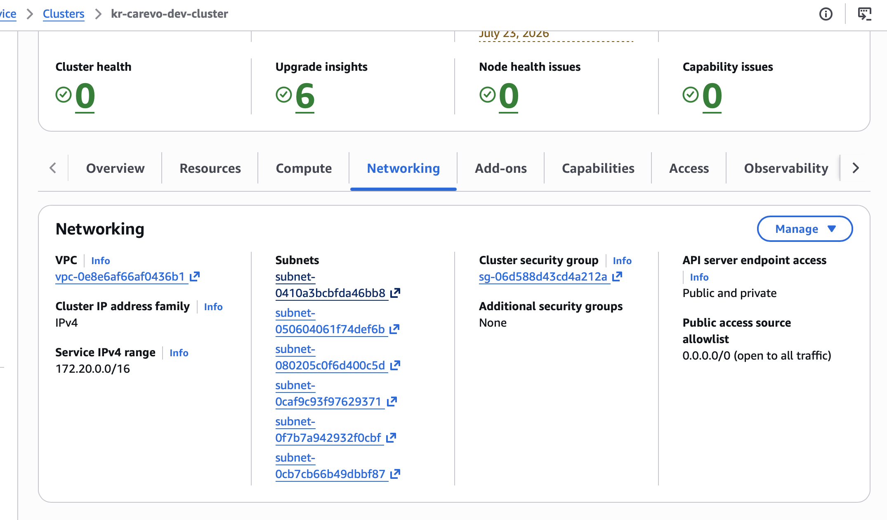

#### Subnet Details

| Subnet Name | Type | Zone | CIDR | Purpose |
|---|---|---|---|---|
| `kr-carevo-dev-public-subnet-ect` | Public (ect) | e-commerce | 10.10.x.x/24 | ALB, NAT Gateway, public resources |
| `kr-carevo-dev-private-subnet-rst` | Private (rst) | restricted | 10.10.10.0/24 | Restricted zone nodegroup, internal services |
| `kr-carevo-dev-private-subnet-ict` | Private (ict) | isolated | 10.10.20.0/24 | Isolated zone nodegroup, sensitive workloads |

**Zone Configuration** (`environment/dev/zoning/*.yaml`)

```yaml
# app zone — restricted (RST)
zone:
  name: app
  label: rst
  cidr: "10.10.10.0/24"
  public: false

# cache zone — isolated (ICT)
zone:
  name: cache
  label: ict
  cidr: "10.10.20.0/24"
  public: false

# web zone — e-commerce (ECT)
zone:
  name: web
  label: ect
  public: true
```

### Subnet & NodeGroup Association

```
kr-carevo-dev-cluster
├── PublicSubnet (ect)
│   └── ALB placement via AWS Load Balancer Controller
│       └── Uses subnets tagged with:
│           - kubernetes.io/role/elb: "1" (ELB)
│           - kubernetes.io/role/alb/ingress: "1" (ALB)
│
├── PrivateSubnet (rst) → kr-carevo-dev-rst-nodegroup
│   ├── Min: 0, Desired: 1, Max: 3 nodes
│   ├── Security Group: kr-carevo-dev-app-rst-sg
│   └── Restricted zone workloads
│
└── PrivateSubnet (ict) → kr-carevo-dev-ict-nodegroup
    ├── Min: 0, Desired: 1, Max: 3 nodes
    ├── Security Group: kr-carevo-dev-app-ict-sg
    └── Isolated zone workloads
```

### Route Table Structure

Each private subnet routes traffic through its zone's **NAT Gateway**:

```
Private Route Table (RST)
├── Local Route: 10.10.0.0/16 → Local
├── Default Route: 0.0.0.0/0 → NAT-RST (in public subnet)
└── Associated with: kr-carevo-dev-private-subnet-rst

Private Route Table (ICT)
├── Local Route: 10.10.0.0/16 → Local
├── Default Route: 0.0.0.0/0 → NAT-ICT (in public subnet)
└── Associated with: kr-carevo-dev-private-subnet-ict

Public Route Table (ECT)
├── Local Route: 10.10.0.0/16 → Local
└── Default Route: 0.0.0.0/0 → Internet Gateway
    └── Associated with: kr-carevo-dev-public-subnet-ect
```

### Instance Accessibility

**Private Subnets:**
- Instances in `rst` and `ict` subnets have **no direct internet access**
- All egress traffic flows through zone-specific NAT Gateways
- Ingress is restricted to security group rules
- **Not directly accessible** from internet

**Public Subnet:**
- ALB/NLB resources are placed here via Ingress annotations
- Direct internet routing via Internet Gateway
- Ingress controller pods manage traffic distribution

### ALB/Ingress Annotation Configuration

The AWS Load Balancer Controller uses subnet annotations for ALB placement:

```yaml
# Service annotation example
service.beta.kubernetes.io/aws-load-balancer-subnets: |
  kr-carevo-dev-public-subnet-ect

# Ingress annotation for security groups
alb.ingress.kubernetes.io/security-groups: |
  kr-carevo-dev-alb-sg
```

**Subnet Tagging Strategy:**

```hcl
tags = {
  "kubernetes.io/cluster/${cluster_name}" = "shared"
  "kubernetes.io/role/elb"                 = "1"      # Classic LB
  "kubernetes.io/role/alb/ingress"         = "1"      # ALB
}
```

---

## Security Architecture

### Security Group & NACL Organization

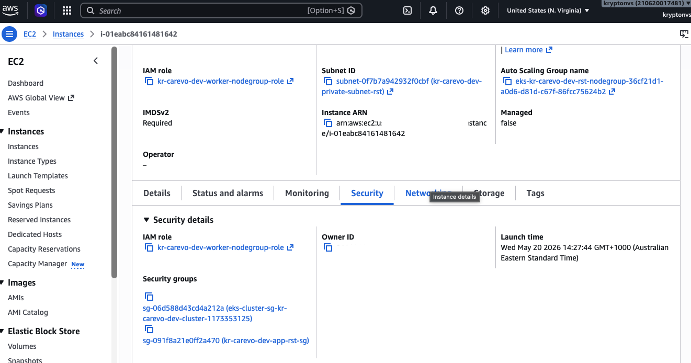

#### Zone-Based Security Groups

Each zone has dedicated security groups for fine-grained traffic control:

| Security Group | Zone | Associated Subnet(s) | Purpose |
|---|---|---|---|
| `kr-carevo-dev-app-rst-sg` | rst | private-subnet-rst | Restricted zone node communication |
| `kr-carevo-dev-app-ict-sg` | ict | private-subnet-ict | Isolated zone node communication |
| `kr-carevo-dev-alb-sg` | ect | public-subnet-ect | ALB ingress/egress |

#### Traffic Flow by Zone

**RST Zone (Restricted):**
```
Ingress Rules:
  └─ IngressController (kubelet: 10250)
     From: AlbSecurityGroup / ClusterSecurityGroup
  └─ Service Mesh (mTLS: 15000-15999)
     From: rst-sg (same zone)
  └─ Metrics (prometheus: 9090)
     From: Monitoring sg

Egress Rules:
  └─ All to 0.0.0.0/0:443 (HTTPS)
  └─ All to VPC CIDR (inter-pod)
```

**ICT Zone (Isolated):**
```
Ingress Rules:
  └─ IngressController (kubelet: 10250)
     From: AlbSecurityGroup / ClusterSecurityGroup
  └─ Cross-Zone Communication (limited range)
     From: rst-sg (restricted zone only)

Egress Rules:
  └─ Only NAT gateway via route table
  └─ No direct cross-zone egress
```

### Network Access Control Lists (NACLs)

Each zone's subnet has NACLs to enforce additional network boundaries:

```
RST Private Subnet NACL
├─ Inbound:
│  ├─ 22 (SSH) - from bastion sg only
│  ├─ 443 (HTTPS) - from anywhere
│  ├─ 10.10.0.0/16 (VPC) - all protocols
│  └─ Ephemeral (1024-65535) - return traffic
│
└─ Outbound:
   ├─ 443 (HTTPS) - to 0.0.0.0/0
   ├─ 53 (DNS) - to 0.0.0.0/0
   └─ 10.10.0.0/16 (VPC) - all protocols

ICT Private Subnet NACL
├─ Inbound:
│  ├─ 443 (HTTPS) - from vpc only
│  ├─ 10.10.0.0/16 (VPC) - all
│  └─ Ephemeral - return traffic
│
└─ Outbound:
   └─ 10.10.0.0/16 only (no internet egress)
```

### Cluster Diagram

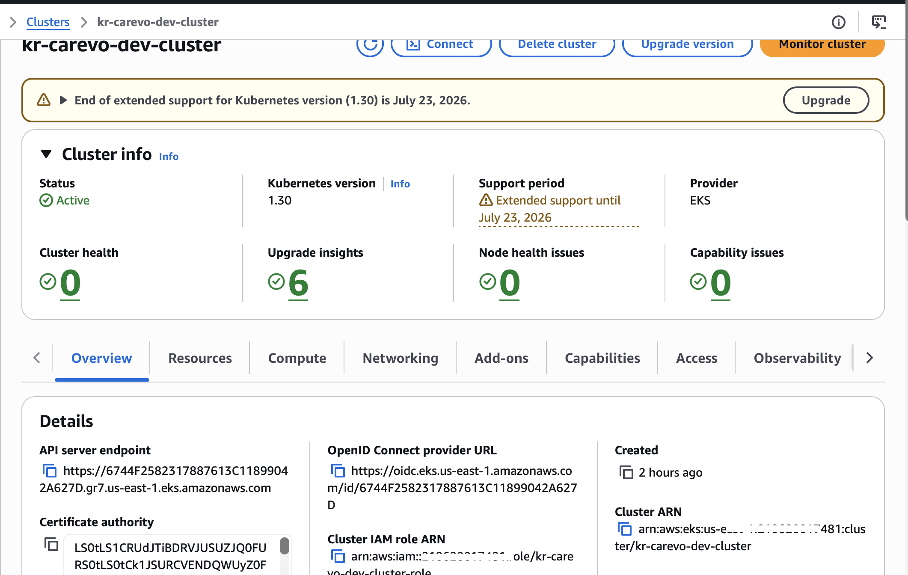

```
┌─────────────────────────────────────────────────────────────┐
│  VPC (10.10.0.0/16)                                         │
├─────────────────────────────────────────────────────────────┤
│                                                              │
│  ┌───────────────────────────────────────────────────────┐ │
│  │ Public Subnet (ECT) - 10.10.0.0/24                  │ │
│  │ ┌────────────────┐  ┌─────────────────────────────┐ │ │
│  │ │   IGW          │  │  ALB (via Ingress annotn)  │ │ │
│  │ └────────────────┘  └─────────────────────────────┘ │ │
│  └───────────────────────────────────────────────────────┘ │
│                                                              │
│  ┌───────────────────────────────────────────────────────┐ │
│  │ Private Subnet (RST) - 10.10.10.0/24                │ │
│  │  NAT-GW  ┌────────────────────────────┐             │ │
│  │ ────────>│ NodeGroup (RST)             │             │ │
│  │          │ ├─ t4g.medium (Spot)       │             │ │
│  │          │ ├─ m6g.large (Spot)        │             │ │
│  │          │ └─ SG: app-rst-sg          │             │ │
│  │          └────────────────────────────┘             │ │
│  └───────────────────────────────────────────────────────┘ │
│                                                              │
│  ┌───────────────────────────────────────────────────────┐ │
│  │ Private Subnet (ICT) - 10.10.20.0/24                │ │
│  │  NAT-GW  ┌────────────────────────────┐             │ │
│  │ ────────>│ NodeGroup (ICT)             │             │ │
│  │          │ ├─ t4g.medium (Spot)       │             │ │
│  │          │ ├─ m6g.large (Spot)        │             │ │
│  │          │ └─ SG: app-ict-sg          │             │ │
│  │          └────────────────────────────┘             │ │
│  └───────────────────────────────────────────────────────┘ │
│                                                              │
└─────────────────────────────────────────────────────────────┘

EKS Control Plane (Managed by AWS)
├─ API Endpoint: Public + Private
├─ etcd: AWS-managed
└─ Communicates via VPC CNI to subnets above
```

---

## Compute Node Options

### EKS-Managed Node Groups ✅ (Currently Supported)

**What:** AWS-managed Auto Scaling Groups that handle node lifecycle

**Management Model:**
- AWS handles provisioning, updates, and termination
- You trigger updates, AWS creates new AMIs, drains pods gracefully
- Integrated with EKS console and API visibility

**Advantages:**
- Automated OS and kubelet patching
- Automatic node draining during updates
- Standard AMI options (Amazon Linux, Bottlerocket, Ubuntu)
- Balance between control and operational ease

**Node Configuration:**
```yaml
scaling_config:
  desired_size: 1    # Current running nodes
  max_size: 3        # Maximum nodes before stopping autoscaling
  min_size: 0        # Minimum idle nodes (can scale to zero)
```

**Capacity Types:**
- `ON_DEMAND` - Full AWS pricing, 100% availability
- `SPOT` - 60-75% discount, can be interrupted with 2-minute notice

---

### Self-Managed Nodes ❌ (Planned for Future)

**What:** EC2 instances you manually provision and connect to EKS control plane

**Why Available:**
- Custom AMIs with compliance hardening
- Specialized hardware or kernels
- AWS Outposts/Local Zones support
- Maximum flexibility

**Management Overhead:**
- Manual patching of OS and kubelet
- Manual ASG management and node draining
- Custom bootstrap scripts
- Full lifecycle responsibility

**Best For:** Highly specialized workloads requiring deviations from AWS defaults

---

### AWS Fargate ❌ (Planned for Future)

**What:** Serverless container compute - you define pods, AWS manages infrastructure

**Operational Savings:**
- Zero node management
- No patching or scaling infrastructure
- Per-pod isolation (dedicated VM boundary)
- Automatic scaling based on pod requests

**Constraints:**
- No DaemonSets (use sidecar pattern)
- No privileged containers
- Pod resource limits determine pricing
- Limited to containerized workloads

**Best For:** Bursty workloads, microservices, zero-ops deployments

---

### Comparison Table

| Feature | Self-Managed | EKS-Managed ✅ | Fargate |
|---|---|---|---|
| Operational Effort | High | **Medium** | Minimal |
| AMI Control | Full | Partial (AWS AMIs) | None (AWS-managed) |
| Isolation | Shared Node | Shared Node | Per-Pod VM |
| Scaling | Manual/Cluster Autoscaler | Managed ASG | Native pod scaling |
| DaemonSet Support | Yes | Yes | No |
| Pricing | EC2 instances | EC2 instances | Per vCPU/RAM/sec |
| Node Access | Full SSH | Limited | No direct access |

---

## Instance Selection & Pricing

### Current Configuration

The cluster is deployed with **EKS-Managed Node Groups** using ARM64 Graviton instances optimized for cost:

**Instance Types Available:**
```yaml
instance_types:
  - "t4g.medium"    # 2 vCPU, 4 GB RAM  - burstable, cheapest
  - "m6g.large"     # 2 vCPU, 8 GB RAM  - general purpose
```

**Capacity Type:** `SPOT` (interruptible, 60-75% savings)

**AMI:** `AL2023_ARM_64_STANDARD` (Amazon Linux 2023, ARM64)

### Why ARM64 Graviton?

1. **40% Better Price/Performance** vs x86 (Intel/AMD)
2. **20% Cheaper** than equivalent x86 on-demand pricing
3. **60-75% Discount** when combined with Spot
4. **Lower Power Consumption** (cost savings reflect efficiency)

### EC2 Instance Types Explained

**t4g.medium** (Burstable)
```
vCPU: 2
Memory: 4 GiB
EBS: Up to 5 Gbps
Use Case: Dev, test, small workloads
On-Demand: ~$0.034/hr
Spot: ~$0.012/hr (65% savings)
```

**m6g.large** (General Purpose)
```
vCPU: 2
Memory: 8 GiB
EBS: Up to 8.75 Gbps
Use Case: Small apps, mixed workloads
On-Demand: ~$0.077/hr
Spot: ~$0.025/hr (68% savings)
```

### Scaling Configuration

Each nodegroup has independent scaling:

```yaml
# RST Nodegroup (Restricted Zone)
scaling_config:
  desired_size: 1   # Usually run 1 node
  max_size: 3       # Scale up to 3 if needed
  min_size: 0       # Can scale to zero

# ICT Nodegroup (Isolated Zone)
scaling_config:
  desired_size: 1
  max_size: 3
  min_size: 0
```

**How Autoscaling Works:**
1. Kubernetes Cluster Autoscaler monitors pending pods
2. If a pod cannot be scheduled, recommends node scale-up
3. ASG launches new node with launch template
4. New node joins cluster via IAM role authentication

---

## Graviton Spot Strategy

### The "Gold Standard" Approach

Combining **Graviton + Spot** achieves maximum savings:

```
On-Demand Graviton:     20% cheaper than x86
Spot Graviton:          60-75% cheaper than on-demand
Spot Graviton Total:    80-92% cheaper than x86 on-demand
```

### Real-World Pricing (US-East-1 Reference)

| Instance Type | vCPU/Memory | On-Demand | Spot | Savings |
|---|---|---|---|---|
| t4g.medium | 2/4 GB | $0.0336/hr | $0.0118/hr | ~65% |
| c6g.xlarge | 4/8 GB | $0.1360/hr | $0.0462/hr | ~66% |
| m6g.xlarge | 4/16 GB | $0.1540/hr | $0.0485/hr | ~68% |
| r6g.xlarge | 4/32 GB | $0.2016/hr | $0.0544/hr | ~73% |
| m7g.xlarge | 4/16 GB | $0.1632/hr | $0.0580/hr | ~64% |

### Spot Interruption Characteristics

**Interruption Rate:** Below 5% for most Graviton sizes (per AWS Spot Instance Advisor)

**2-Minute Warning Pattern:**
- AWS sends EC2 Instance Interruption Warning (CloudWatch event)
- Kubelet drains the node gracefully
- Pods evict and reschedule on other nodes
- New instances launch via cluster autoscaling

### Risk Mitigation for Production

**Current:** All nodegroups use Spot instances

**For Production, Implement Mixed-Capacity Strategy:**

```yaml
nodegroup:
  - name: "kr-carevo-PROD-ondemand"
    instance_types: ["m6g.large"]
    capacity_type: "ON_DEMAND"      # Stable capacity
    scaling_config:
      desired_size: 2
      max_size: 5
      min_size: 1

  - name: "kr-carevo-PROD-spot"
    instance_types: ["m6g.large", "t4g.medium"]
    capacity_type: "SPOT"            # Cost-optimized
    scaling_config:
      desired_size: 3
      max_size: 10
      min_size: 0
```

**Pod Resilience Configuration:**

```yaml
apiVersion: v1
kind: Pod
metadata:
  labels:
    workload-type: stateless
spec:
  affinity:
    podAntiAffinity:
      preferredDuringSchedulingIgnoredDuringExecution:
        - weight: 100
          podAffinityTerm:
            labelSelector:
              matchExpressions:
                - key: app
                  operator: In
                  values: ["myapp"]
            topologyKey: kubernetes.io/hostname
  tolerations:
    - key: "spot"
      operator: "Equal"
      value: "true"
      effect: "NoSchedule"
```

### Timezone Advantage (India Dev)

**East-US AZ Capacity During India Day:**
- East-US region observes UTC-5 (ET)
- India observes UTC+5:30 (IST)
- 10.5-hour timezone difference works in your favor
- US daytime = India evening/night = lower demand = better Spot availability
- Spin up instances during India morning for East-US daytime capacity

---

## AL2023_ARM_64_STANDARD AMI Details

### Hardware Architecture: ARM64 (AWS Graviton)

**Processor Family:**
- Custom AWS Graviton processors (Graviton 2/3/4 line)
- 64-bit RISC architecture (not x86)
- Available EC2 families: m6g, c6g, r6g, t4g, m7g, c7g, etc.

**Workload Compatibility Requirements:**

❌ **Will NOT Work:**
```dockerfile
FROM ubuntu:22.04
RUN apt-get install myprogram  # If compiled for x86_64 only
```

✅ **Will Work:**
```dockerfile
FROM --platform=linux/arm64 ubuntu:22.04
RUN apt-get install myprogram
# or for multi-arch
```

**Docker Multi-Architecture Build:**

```dockerfile
FROM --platform=${BUILDPLATFORM} golang:1.21 as builder
ARG TARGETPLATFORM
RUN GOOS=linux GOARCH=arm64 go build -o app .

FROM --platform=linux/arm64 alpine:latest
COPY --from=builder /workspace/app /app
CMD ["/app"]
```

**Build Command:**
```bash
docker buildx build \
  --platform linux/amd64,linux/arm64 \
  -t myapp:latest .
```

### Operating System: Amazon Linux 2023 (AL2023)

**What's New vs AL2:**
- Modern Linux kernel optimized for AWS
- Significantly **faster node boot times** during autoscaling
- Container-native design
- Smaller footprint (~500MB vs 1GB+)

**Package Manager:** `dnf` (successor to yum)

```bash
# On node shell
dnf install -y git  # not yum
dnf search package
```

**Cgroup v2 (Control Groups v2):**
- Unified hierarchy for resource management
- Kubernetes can manage resources more granularly per-pod
- Better memory and CPU accounting
- More efficient resource isolation

**Kernel Features:**
- BTF (BPF Type Format) for eBPF support
- Modern seccomp options
- Optimized for cloud workloads

### Pre-Installed Kubernetes Components

These are baked into the AMI (no downloads needed):

**Container Runtime:** `containerd` (not Docker)
```bash
# Docker/Dockershim removed from EKS
# All pods managed by containerd directly
# Verify: systemctl status containerd
```

**Kubelet:** Node agent communicating with EKS control plane
```bash
# Located at: /usr/bin/kubelet
# Managed by systemd
systemctl status kubelet
```

**AWS IAM Authenticator:** Secure authentication
```bash
# Located at: /usr/bin/aws-iam-authenticator
# Used by kubelet to authenticate to Kubernetes API
```

**CNI Plugin:** Networking (for pod-to-pod communication)
```bash
# AWS VPC CNI installed by default
# Pods get ENIs directly
```

### Available AMI Options Comparison

| AMI Type | Architecture | OS | Use Case |
|---|---|---|---|
| AL2_x86_64 | x86_64 | Amazon Linux 2 | Legacy, x86 apps |
| AL2_x86_64_GPU | x86_64 | AL2 + NVIDIA CUDA | GPU workloads |
| AL2023_x86_64_STANDARD ✅ | x86_64 | Amazon Linux 2023 | Modern x86 deployments |
| **AL2023_ARM_64_STANDARD** ✅ | ARM64 | Amazon Linux 2023 | **Cost-optimized (current)** |
| BOTTLEROCKET_ARM_64 | ARM64 | Bottlerocket | Container-focused |
| BOTTLEROCKET_x86_64 | x86_64 | Bottlerocket | Container-focused |
| WINDOWS_CORE_2022 | x86_64 | Windows | Windows apps |
| WINDOWS_FULL_2022 | x86_64 | Windows | Windows apps |

### Why AL2023_ARM_64_STANDARD Was Chosen

**Decision Factors:**

1. **Cost:** 80-92% savings vs x86 on-demand
2. **Performance:** 40% better price-to-performance ratio
3. **Modern OS:** Faster boots, optimized kernel
4. **Workload Support:** Most containerized apps are multi-arch
5. **Future-Proof:** ARM becoming industry standard

**Stack:**
```
┌─────────────────────────────────────────┐
│  Your Containerized Workload            │
│  (Go, Python, Java, Node.js, etc.)      │
├─────────────────────────────────────────┤
│  containerd (container runtime)         │
├─────────────────────────────────────────┤
│  Kubelet (node agent)                   │
├─────────────────────────────────────────┤
│  Amazon Linux 2023 Kernel               │
│  (optimized for cloud)                  │
├─────────────────────────────────────────┤
│  AWS Graviton Processor (ARM64)         │
│  (cost-efficient, 40% better perf/watt) │
└─────────────────────────────────────────┘
```

---

## Known Issues & Troubleshooting

### Issue: EC2 Instances Failed to Join Cluster

**Symptoms:**
```
Node status: "NotReady"
Error: Instance failed to join cluster
AWS Console: Node provisioned but not available in Kubernetes
```

**Root Causes:**
- Spot instance interrupted before node bootstrap complete
- Subnet/security group misconfiguration
- IAM role lacking required permissions
- DHCP/networking issues during bootstrap

**Solution:**

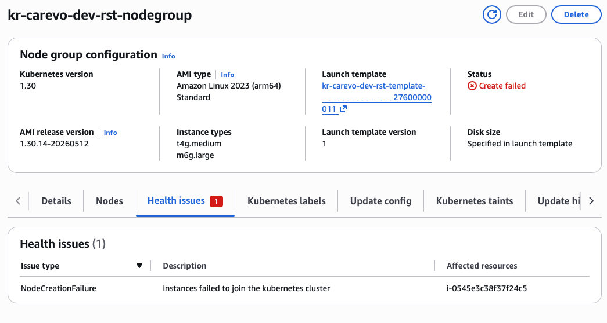

1. **Check instance logs (Node not joining after 10 minutes):**
   ```bash
   # On the node (via Systems Manager Session Manager)
   tail -100 /var/log/messages
   tail -100 /var/log/kubelet.log
   
   # Check certificate issues
   ls -la /etc/kubernetes/pki/
   ```

2. **Verify security group allows kubelet communication:**
   ```yaml
   Ingress:
     - Port: 10250  # Kubelet API
       From: ClusterSecurityGroup
     - Port: 443    # API requests
       From: 0.0.0.0/0
   ```

3. **Check subnet DNS resolution:**
   ```bash
   # On node
   nslookup kubernetes.default
   nslookup krypt..amazonaws.com  # Control plane endpoint
   ```

4. **Retry with delay (Spot capacity issue):**
   ```bash
   # Manual recovery
   terraform taint aws_eks_node_group.kr_nodegroup["cluster__nodegroup"]
   terraform apply
   
   # Or force ASG scaling
   aws autoscaling set-desired-capacity \
     --auto-scaling-group-name kr-carevo-nodegroup-asg \
     --desired-capacity 1
   ```

5. **Timezone Advantage:** East-US region typically has better Spot capacity during:
   - India morning hours (UTC+5:30) = US late night
   - India afternoon (UTC+5:30) = US morning
   - Avoid India evening when US is also in business hours

---

### Known Limitation: EKS-Managed Only

**Current Support Matrix:**

| Feature | Status | Notes |
|---|---|---|
| EKS-Managed Node Groups | ✅ Supported | Primary approach |
| Self-Managed Nodes | 🔄 Planned | For future custom requirements |
| AWS Fargate | 🔄 Planned | For zero-ops workloads |
| Karpenter Autoscaling | 🔄 Planned | Currently using native ASG |

**Code Filtering:**
```hcl
# Only processes clusters with mode = "managed"
managed_clusters = {
  for cluster in var.eks_clusters :
  cluster.name => cluster
  if var.eks_enabled && lower(cluster.mode) == "managed"
}

# Self-managed and Fargate modes are skipped
```

**Future Extension Path:**
```hcl
# Planned in terraform modules
if lower(cluster.mode) == "managed" -> aws_eks_node_group
if lower(cluster.mode) == "self" -> aws_launch_template + aws_autoscaling_group
if lower(cluster.mode) == "fargate" -> aws_eks_fargate_profile
```

---

### Known Limitation: create_before_destroy Not Supported

**Current Behavior:**
```yaml
lifecycle:
  create_before_destroy: false  # Nodes replaced one-at-a-time
```

**Impact:**
- Terraform destroys old launch template before creating new one
- Single node gap during updates (not zero-downtime)
- Can cause service interruptions if not managed

**Workaround (Manual):**
```bash
# Create new nodegroup manually first
aws eks create-nodegroup \
  --cluster-name kr-carevo-dev-cluster \
  --nodegroup-name kr-carevo-NEW-nodegroup \
  --subnets subnet-xxx \
  --node-role arn:aws:iam::xxx:role/nodegroup-role

# Wait for nodes to be Ready
kubectl get nodes -w

# Drain and delete old nodegroup
kubectl drain nodename --ignore-daemonsets
aws eks delete-nodegroup \
  --cluster-name kr-carevo-dev-cluster \
  --nodegroup-name kr-carevo-old-nodegroup
```

**Future Fix:**
```hcl
lifecycle {
  create_before_destroy = true
}
```

---

### Known Limitation: Karpenter Not Available

**Current:** Native AWS ASG (Auto Scaling Group) with Cluster Autoscaler

**Planned:** Karpenter for more efficient, cost-aware scaling

**Difference:**

| Feature | ASG + Cluster Autoscaler | Karpenter |
|---|---|---|
| Provisioning | Roll out full instance | Right-size per pod |
| Speed | 1-2 minutes | 20-30 seconds |
| Cost | Instance-level optimization | Per-pod packing |
| Consolidation | Manual tuning | Automatic bin-packing |
| Billing | Pay for full instance | Better utilized instances |

**Current ASG Configuration:**
```yaml
scaling_config:
  min_size: 0
  desired_size: 1
  max_size: 3

# Cluster Autoscaler checks every 10 seconds
# Launches nodes based on pending pods
```

---

### Issue: Spot Instance Interruptions (Capacity Failures)

**Symptoms:**
```
Pod eviction after 2-minute warning
Nodes terminating unexpectedly
Workload failing to reschedule
```

**Why This Happens:**
- AWS reclaims Spot capacity when on-demand demand spikes
- Guaranteed 2-minute notice via CloudWatch event
- Cluster autoscaler attempts to launch replacement (may fail if capacity exhausted)

**Mitigation:**

1. **Implementation: Mixed Capacity Strategy**
   ```yaml
   nodegroups:
     - 50% on-demand (stable capacity)
     - 50% Spot (cost savings)
   ```

2. **Pod Configuration:**
   ```yaml
   apiVersion: v1
   kind: Pod
   metadata:
     name: resilient-app
   spec:
     restartPolicy: Always  # Automatically restart on eviction
     affinity:
       podAntiAffinity:
         preferredDuringScheduling...:  # Spread across nodes
   ```

3. **Monitoring:**
   ```bash
   # Watch for EC2 Instance Interruption Warnings
   aws events describe-rule \
     --name EC2InstanceStateChange \
     --region us-east-1
   ```

---

### Issue: AmazonEKSViewPolicy Missing for Developers

**Symptoms:**
```
Error: "User is not authorized to perform: eks:DescribeCluster"
kubectl auth list-claims: Not authorized
```

**Root Cause:**
- Developers need EKS access entry to view cluster
- currently requires manual IAM configuration
- Policy not yet script-driven in Terraform

**Current Configuration** (manual):

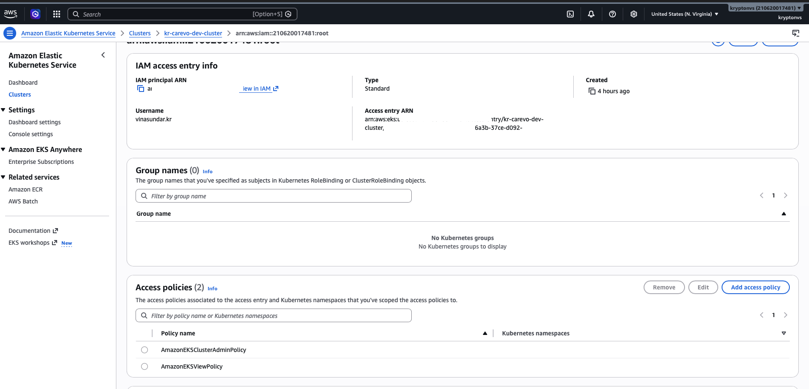

**Solution - Temporary (until scripted):**

1. **Add viewer policy to developer user's role:**
   ```json
   {
     "Version": "2012-10-17",
     "Statement": [
       {
         "Effect": "Allow",
         "Action": [
           "eks:DescribeCluster",
           "eks:DescribeNodegroup",
           "eks:ListFargateProfiles",
           "eks:DescribeAddonVersions"
         ],
         "Resource": "arn:aws:eks:*:210620017481:cluster/*"
       }
     ]
   }
   ```

2. **Create EKS Access Entry:**
   ```bash
   aws eks create-access-entry \
     --cluster-name kr-carevo-dev-cluster \
     --principal-arn arn:aws:iam::210620017481:user/bandit_dev \
     --type STANDARD
   
   # Associate with viewer policy
   aws eks associate-access-policy \
     --cluster-name kr-carevo-dev-cluster \
     --principal-arn arn:aws:iam::210620017481:user/bandit_dev \
     --policy-arn arn:aws:eks::aws:cluster-access-policy/AmazonEKSViewPolicy \
     --access-scope type=cluster
   ```

3. **Configure kubeconfig:**
   ```bash
   aws eks update-kubeconfig \
     --region us-east-1 \
     --name kr-carevo-dev-cluster \
     --profile bandit_dev
   
   kubectl auth can-i list pods --namespace=default
   ```

**Future (Script-Driven):**
```yaml
# Planned in identity.yml
component:
  - sid: kr-carevo
    cluster:
      - name: kr-carevo-dev-cluster
        access_entries:
          - principal_arn: "arn:aws:iam::210620017481:user/bandit_dev"
            policy_arn: "AmazonEKSViewPolicy"
            access_scope: "cluster"
```

---

### Scaling Insights

#### Recommended for PRODUCTION

```yaml
nodegroup:
  - name: "kr-carevo-prod-ondemand"
    capacity_type: "ON_DEMAND"
    scaling_config:
      desired_size: 2      # Always 2 running
      max_size: 5
      min_size: 1          # At least 1

  - name: "kr-carevo-prod-spot"
    capacity_type: "SPOT"
    scaling_config:
      desired_size: 3      # 3 cost-optimized
      max_size: 10
      min_size: 0          # Can scale to zero
```

#### DEV Scaling
```yaml
scaling_config:
  desired_size: 0    # Scale to zero when not in use
  max_size: 2        # Manual scaling for testing
  min_size: 0
```

---

## Diagrams & Visual Reference

### Complete Cluster Diagram


### Subnet Association


### NodeGroup & Instance Association

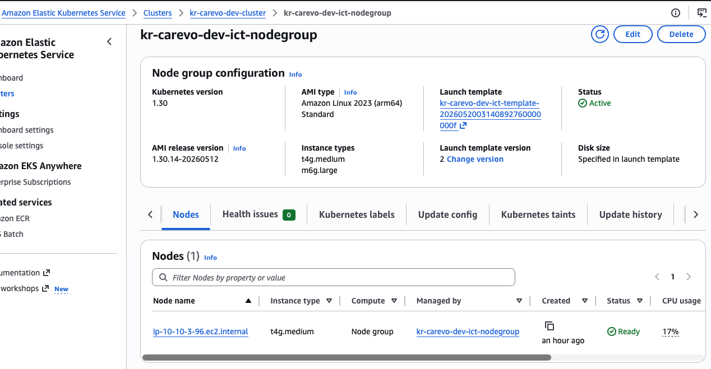

### Launch Template Configuration

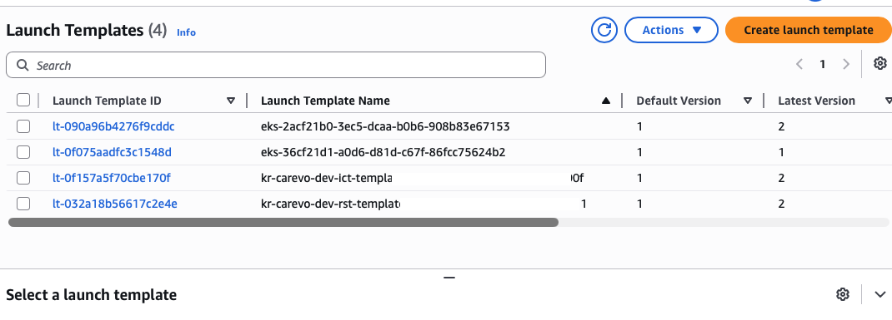

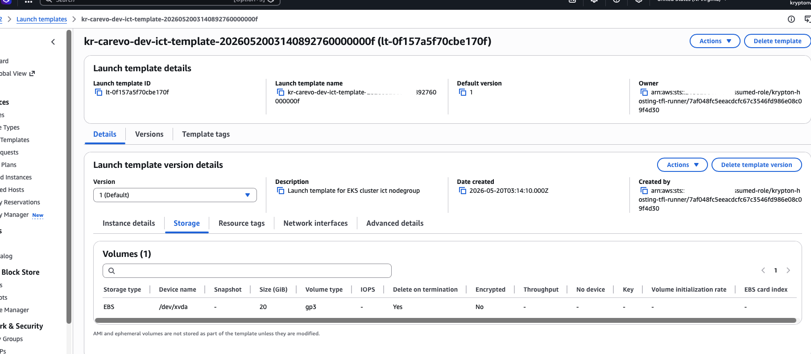

### Node Groups Overview

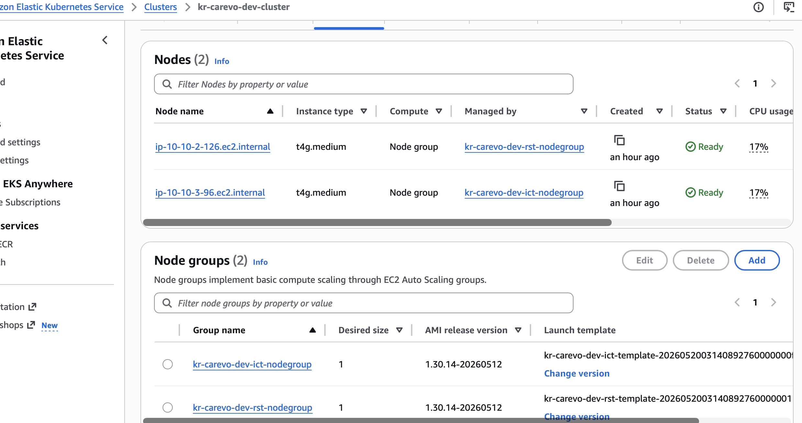

### Instance Categories (Graviton Spot)

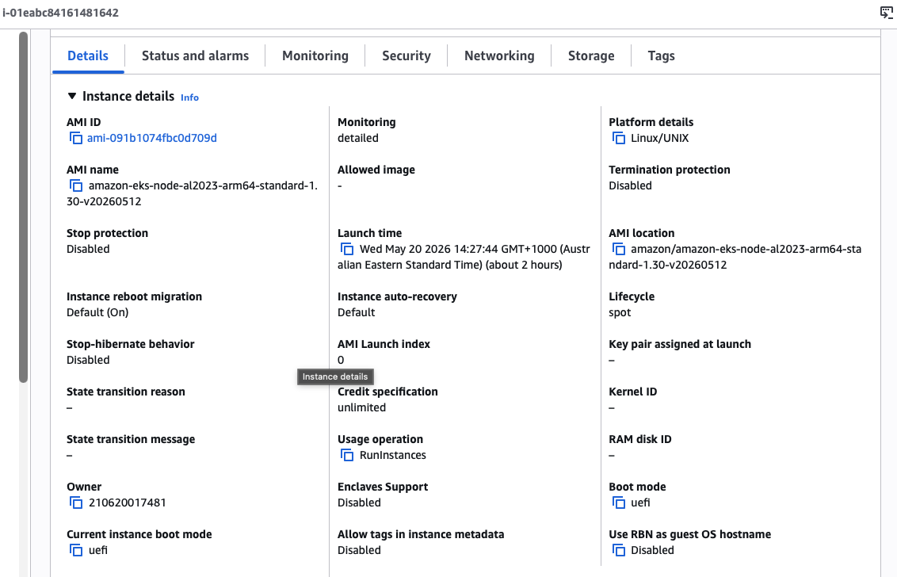

### Security Group Association


### Access Entry Configuration


### Autoscaling Groups

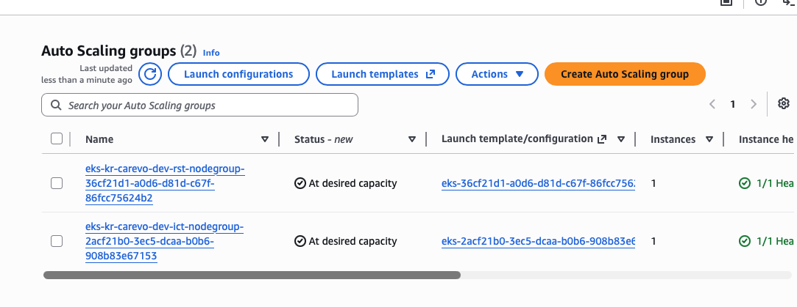

### Troubleshooting: Spot Errors


---

## Quick Reference Commands

### View Cluster Status

```bash
# List clusters
aws eks list-clusters --region us-east-1

# Describe cluster
aws eks describe-cluster \
  --name kr-carevo-dev-cluster \
  --region us-east-1

# Get cluster details via kubectl
kubectl cluster-info
kubectl get nodes -o wide
```

### Nodegroup Operations

```bash
# List nodegroups
aws eks list-nodegroups \
  --cluster-name kr-carevo-dev-cluster

# Describe nodegroup
aws eks describe-nodegroup \
  --cluster-name kr-carevo-dev-cluster \
  --nodegroup-name kr-carevo-dev-ict-nodegroup

# Get nodegroup status
kubectl get nodes -L kubernetes.io/arch,node.kubernetes.io/instance-type

# Node resource utilization
kubectl top nodes
kubectl describe node node-name
```

### IAM Access Verification

```bash
# Check access entries
aws eks list-access-entries \
  --cluster-name kr-carevo-dev-cluster

# View associated policies
aws eks list-access-policies

# Verify user permissions
aws sts get-caller-identity
```

### Debugging Node Issues

```bash
# SSH to node (via Systems Manager)
aws ssm start-session \
  --target i-xxxxxxxx

# Inside node: check kubelet
systemctl status kubelet
journalctl -u kubelet -n 50

# Check networking
ping 8.8.8.8  # Should work via NAT
ip route show
ip link show
```

### Scaling Operations

```bash
# Manual scale up
aws autoscaling set-desired-capacity \
  --auto-scaling-group-name kr-carevo-dev-ict-nodegroup-asg \
  --desired-capacity 2

# View ASG status
aws autoscaling describe-auto-scaling-groups \
  --auto-scaling-group-names kr-carevo-dev-ict-nodegroup-asg
```

---

## Known Issues & Limitations

| Issue | Current Status | Severity | Description | Workaround | Reference | Timeline |
|---|---|---|---|---|---|---|
| **EKS-Managed Node Groups Only** | Current Support | ⚠️ High | Only mode="managed" clusters created. Self-managed and Fargate modes skipped. | Use EKS-managed nodegroups; manual EC2 provisioning for self-managed needs | [Module Logic](#cluster-architecture--modules) | Q3-Q4 2026 |
| **Spot Instance Capacity Failures** | Current Limitation | 🔴 Critical | All nodegroups use SPOT capacity; may fail if no capacity available in region. Instance fails to join cluster after 2-minute warning. | **For Production:** Use mixed ON_DEMAND (desired=2, min=1) + SPOT (desired=3); Retry after 60s delay. Leverage timezone advantage: India morning = US night = better capacity. | [Spot Error](.docs/cluster/spot-error.png) | Post self-managed |
| **create_before_destroy Not Supported** | Current Limitation | 🟡 Medium | `lifecycle.create_before_destroy = false` causes momentary zero-node gap during updates. Results in 30-60s service interruption when modifying launch template. | Manual workaround: Create new nodegroup first, drain old nodegroup, delete old. OR use `terraform taint` to force replacement. | [Node Updates](#issue-nodegroup-updates) | Q4 2026 |
| **Karpenter Not Available** | Planned | 🟡 Medium | Native ASG scales by full instances (1-2 min). Karpenter provides pod-aware scaling (30s) + bin-packing for cost savings. | Current implementation uses AWS ASG with Cluster Autoscaler. Cost-optimized for stable workloads. Dynamic workloads see 1-2min scale latency. | [Autoscaling Strategy](#scaling-insights) | Q1 2027 |
| **AmazonEKSViewPolicy Not Automated** | Manual Process | 🟡 Medium | **⚠️ IMPORTANT** Developers cannot access cluster without manual EKS access entry config. Every user needs 3 separate AWS CLI steps to view nodes/resources. | **Manual solution:** Create access entry via `aws eks create-access-entry`, associate `AmazonEKSViewPolicy`, update kubeconfig. | [Access Entry](.docs/cluster/access-entry.png) | Next Sprint |
| **Docker Images Must Support ARM64** | Current Limitation | 🔴 Critical | Nodes run ARM64 (Graviton) architecture. Container images compiled only for x86_64 will fail with `exec format error` or `CrashLoopBackOff`. | Build multi-architecture images: `docker buildx build --platform linux/amd64,linux/arm64`. Use base images with ARM64 support (Alpine, Ubuntu, Go, Python, Node.js all support). Verify with DockerHub multi-arch badge. | [AL2023_ARM_64_STANDARD Details](#al2023_arm_64_standard-ami-details) | N/A (Architecture Requirement) |

### Spot Failure Timezone Advantage

East-US region Spot capacity peaks when India is in working hours due to 10.5-hour timezone offset:

| India Time | US-East Time | Capacity | Best For |
|---|---|---|---|
| 09:00-12:00 (Morning) | 23:30-02:30 (Night) | ✅ **Very High** | Critical deployments |
| 12:00-15:00 (Noon) | 02:30-05:30 (Early AM) | ✅ High | Cost-optimized tasks |
| 15:00-18:00 (Afternoon) | 05:30-08:30 (Morning) | ⚠️ Medium | Non-critical |
| 18:00+ (Evening) | 08:30+ (Business) | ⚠️ Low | Avoid Spot scaling |

**Recommendation:** Schedule critical deployments 09:00-15:00 IST for optimal Spot capacity.

---

## Additional Resources

- [AWS EKS Documentation](https://docs.aws.amazon.com/eks/)
- [Kubernetes Official Docs](https://kubernetes.io/docs/)
- [AWS Graviton Performance](https://aws.amazon.com/ec2/graviton/)
- [AWS Spot Instance Advisor](https://spot-bid-advisor.amazonaws.com/)
- [Amazon EC2 Instance Types](https://aws.amazon.com/ec2/instance-types/)
- [AL2023 Release Notes](https://docs.aws.amazon.com/linux/al2/release-notes/)
- [AWS Load Balancer Controller](https://kubernetes-sigs.github.io/aws-load-balancer-controller/)
- [Container Registries (ECR)](https://docs.aws.amazon.com/ecr/)
- [AWS EKS Access Management](https://docs.aws.amazon.com/eks/latest/userguide/access-entries.html)
- [Spot Instance Advisor Tool](https://spot-bid-advisor.amazonaws.com/)

---

**Last Updated:** May 2026  
**Cluster Version:** Kubernetes 1.30  
**Region:** us-east-1  
**Status:** ✅ Production Ready (with mixed capacity for Spot interruptions)  
**Critical Reminders:**
- ⚠️ **For Production:** Always use mixed ON_DEMAND + SPOT capacity (minimum 1 on-demand always running)
- ⚠️ **Developer Access:** Manually configure EKS access entries until automation is available
- 🔴 **Spot Failures:** Retry after 60 seconds; use timezone advantage (India morning = US night = better capacity)
- 🟡 **Node Updates:** Use manual workaround with create-before-destroy until terraform code is updated
