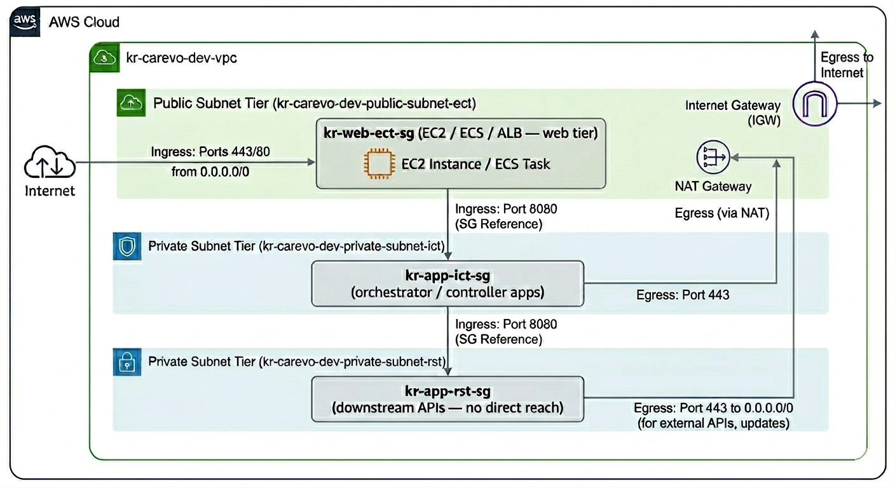
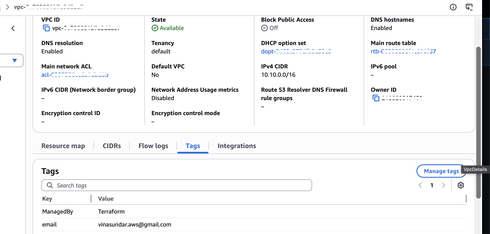
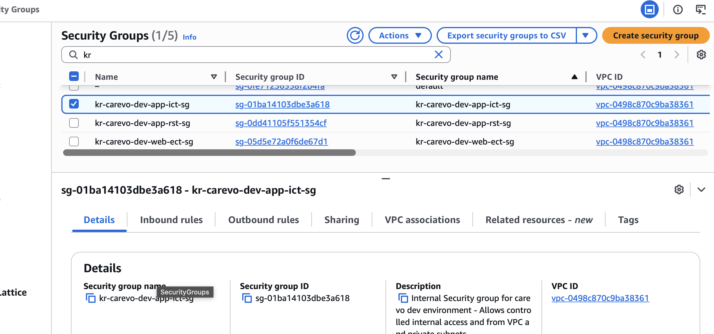
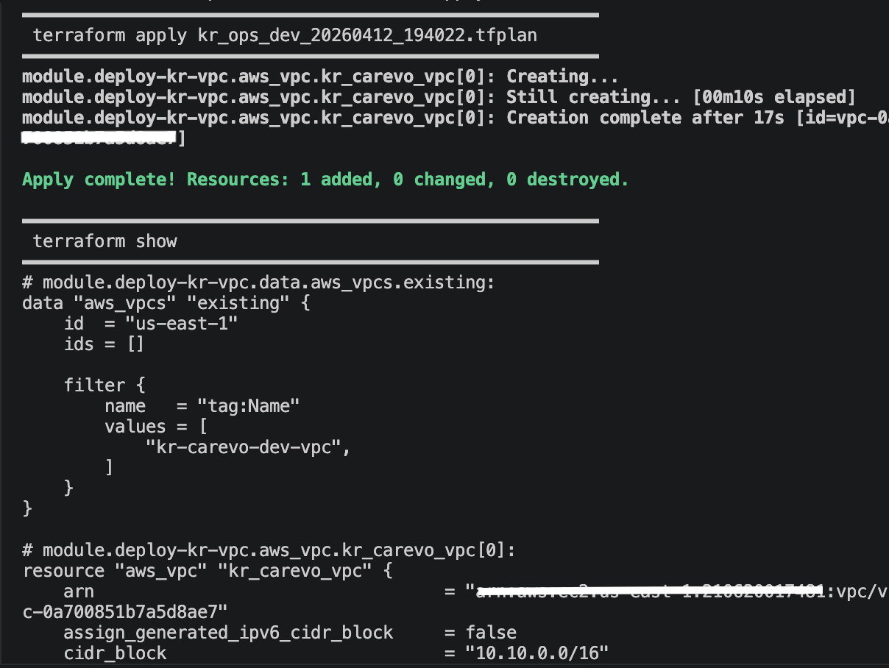

# Krypton.IAC.AWS.Hosting

AWS Infrastructure-as-Code hosting platform using Terraform and IAM Roles Anywhere for keyless On-prem authentication and GHA STS OIDC provider for execution via Github actions pipelines.

## Architecture Overview

This platform organises AWS network resources into named **zones** — logical tiers that map to distinct security boundaries. Each zone is expressed as a combination of VPC, subnets, route tables, NAT/IGW, security groups, and NACLs, and is encoded in resource names using a zone-suffix convention.

### Zone Model

| Zone Suffix | Tier | Components | Visibility | Example Resource |
|---|---|---|---|---|
| `ect` | Web / Edge | internet facing Web | Public (internet-reachable) | `kr-carevo-dev-public-subnet-ect`, `kr-web-ect-sg` |
| `ict` | App / Controller | Orchestrator's , Controllers , Agent Farms , Experience API. | Private (no direct internet) | `kr-carevo-dev-private-subnet-ict`, `kr-app-ict-sg` |
| `rst` | Downstream API / Data | Domain API'S , SOR API's, MCP Servers , Agent Farms | Private (isolated, restricted) | `kr-carevo-dev-private-subnet-rst`, `kr-app-rst-sg` |

### Network Boundary Components

| Component | Role |
|---|---|
| **VPC** | Hard boundary for all resources; single CIDR block (e.g., `10.10.0.0/16`) per program |
| **Subnets** | One subnet per zone per availability zone; public subnets mapped to IGW, private subnets to NAT |
| **Internet Gateway (IGW)** | Attached to the VPC; the public route table points `0.0.0.0/0` here — enables inbound internet access for the `ect` zone |
| **NAT Gateway** | Deployed in the public subnet; private route tables point `0.0.0.0/0` here — provides outbound-only internet egress for `ict` and `rst` zones |
| **Route Tables** | One per zone tier; control which gateway handles outbound `0.0.0.0/0` traffic (IGW for public, NAT for private) |
| **Security Groups (SG)** | Stateful, per-resource east-west firewall rules; each zone carries a named SG scoped by tier and zone suffix |
| **NACLs** | Stateless subnet-level guardrail applied per subnet tier as a coarse perimeter filter before SG evaluation |


- **`ect` zone** — public subnet; receives inbound traffic on ports 443/80 from the internet through the IGW; `kr-web-ect-sg` permits only those ports inbound from `0.0.0.0/0`.
- **`ict` zone** — private subnet; reachable only from `kr-web-ect-sg` on port 8080 via SG reference (no public route); outbound internet egress via NAT Gateway on port 443 for AWS API calls and updates.
- **`rst` zone** — private isolated subnet; reachable only from `kr-app-ict-sg` on port 8080 via SG reference; no inbound internet path; outbound egress via NAT on port 443 for external API calls and package updates.



---

Self Hosted - pipeline setup 
Note : Cost for AWS Trust anchor - $0.10 per 100 credential requests

## Bootstrap: Certificate, Trust Anchor, Role & Profile Setup

> **Note:** The following steps use a **self-signed certificate** as a temporary trust anchor during initial implementation. This should be replaced with a certificate issued by a registered CA provider before production use.

The bootstrap process is a one-time setup that establishes the IAM trust chain required for the Terraform runner to authenticate to AWS without long-lived static credentials. It comprises three steps:

1. Create a dedicated IAM user with the minimum permissions needed to run the CLI scripts
2. Generate a self-signed CA certificate to act as the trust anchor
3. Create the IAM role, trust anchor, and Roles Anywhere profile in AWS

---

## Step 1 — Create the IAM Bootstrap User

A dedicated IAM user (`admin_krypton`) is required to execute the CLI scripts in Steps 2 and 3. This user holds the minimum permissions needed to create the trust anchor, IAM role, and Roles Anywhere profile. It is a **bootstrap-only** credential — once setup is complete the Terraform runner authenticates via Roles Anywhere and this user's access keys should be deactivated.

### 1.1 — Create the user

In the AWS Console navigate to **IAM → Users → Create user**. Name the user `admin_krypton` (or your preferred name) and do not enable console access.


After creation, go to the **Security credentials** tab and create an **Access key** with the use-case *Other*. Save the Access Key ID and Secret Access Key — they are required in Step 3.

### 1.2 — Attach the permissions policy

Attach the following inline policy (`Krypton_CLI_IAM`) to the user. The policy grants the minimum actions needed to create the trust anchor, IAM role, inline permissions policy, and Roles Anywhere profile.


The user should have two policies attached:
- `Krypton_CLI_IAM` — customer inline policy (below)
- `SignInLocalDevelopmentAccess` — AWS managed policy for local CLI sign-in

**Policy document** (`.docs/policy.json`):

```json
{
  "Version": "2012-10-17",
  "Statement": [
    {
      "Sid": "CreateAndManageRoles",
      "Effect": "Allow",
      "Action": [
        "iam:CreateRole",
        "iam:GetRole",
        "iam:AttachRolePolicy",
        "iam:PutRolePolicy",
        "iam:TagRole"
      ],
      "Resource": "*"
    },
    {
      "Sid": "ManageRolesAnywhere",
      "Effect": "Allow",
      "Action": [
        "rolesanywhere:CreateTrustAnchor",
        "rolesanywhere:CreateProfile",
        "rolesanywhere:GetTrustAnchor",
        "rolesanywhere:ListTrustAnchors",
        "rolesanywhere:TagResource"
      ],
      "Resource": "*"
    },
    {
      "Sid": "AllowPassRole",
      "Effect": "Allow",
      "Action": "iam:PassRole",
      "Resource": "*",
      "Condition": {
        "StringEquals": {
          "iam:PassedToService": "rolesanywhere.amazonaws.com"
        }
      }
    },
    {
      "Sid": "AllowRolesAnywhereServiceLinkedRole",
      "Effect": "Allow",
      "Action": "iam:CreateServiceLinkedRole",
      "Resource": "arn:aws:iam::*:role/aws-service-role/rolesanywhere.amazonaws.com/AWSServiceRoleForRolesAnywhere",
      "Condition": {
        "StringEquals": {
          "iam:AWSServiceName": "rolesanywhere.amazonaws.com"
        }
      }
    },
    {
      "Sid": "AllowOIDCProviderManagement",
      "Effect": "Allow",
      "Action": [
        "iam:CreateOpenIDConnectProvider",
        "iam:GetOpenIDConnectProvider",
        "iam:ListOpenIDConnectProviders"
      ],
      "Resource": "*"
    }
  ]
}
```

---

## Step 2 — Generate the Self-Signed Certificate

Run `create-cert.sh` from the `.auth` directory to generate a self-signed CA certificate and private key. This certificate will be uploaded to IAM Roles Anywhere as the trust anchor source in Step 3.

```bash
cd .auth
./create-cert.sh
```

The script generates an EC key pair (P-256 by default) and a self-signed CA certificate valid for 10 years using the configuration in `vars.sh`. On completion it prints the certificate details and the paths to the output files.


Key outputs written to `.auth/cert/`:

| File | Purpose |
|---|---|
| `krypton_hosting_provider_trust_anchor.key.pem` | Private key — **keep secret, never upload** |
| `krypton_hosting_provider_trust_anchor.cert.pem` | Public CA certificate — uploaded as the trust anchor |

Default values are set in `.auth/vars.sh` and can be overridden by environment variable or flag:

| Variable | Default | Description |
|---|---|---|
| `CERT_CN` | `krypton-hosting-provider-trust-anchor` | Certificate common name |
| `TA_NAME` | `krypton-hosting-platform-digiplac` | Trust anchor name in AWS |
| `TA_ROLE_NAME` | `krypton-hosting-tfl-runner` | IAM role name (Roles Anywhere) |
| `GHA_ROLE_NAME` | `krypton-hosting-gha-exec` | IAM role name (GitHub Actions) |
| `KEY_TYPE` | `ec` | Key algorithm (`ec` or `rsa`) |
| `EC_CURVE` | `prime256v1` | EC curve (P-256 or P-384) |
| `CERT_DAYS` | `3650` | Certificate validity in days |

---

## Step 3 — Create the Roles Anywhere Trust Anchor & GitHub Actions Role

This step is split into two sub-scripts orchestrated by a single entry point.

### Architecture overview

| Auth method | Script | AWS resources created |
|---|---|---|
| IAM Roles Anywhere (local Terraform) | `create-ta-role.sh` | Trust anchor, IAM role `krypton-hosting-tfl-runner`, Roles Anywhere profile |
| GitHub Actions OIDC | `create-gha-role.sh` | IAM role `krypton-hosting-gha-exec`, OIDC provider `token.actions.githubusercontent.com` |

Run the orchestrator from the `.auth` directory. It prompts for AWS credentials **once**, then calls each sub-script in turn:

```bash
cd .auth
./setup.sh
```

`setup.sh` flow:
1. Prompt for `admin_krypton` AWS credentials (written to a named CLI profile)
2. Verify credentials via `sts:GetCallerIdentity`
3. **Step 1 of 2** — run `create-ta-role.sh`
4. **Step 2 of 2** — run `create-gha-role.sh`

You can also run each sub-script independently if you only need to (re-)create one of the roles:

```bash
./create-ta-role.sh  --region us-east-1 --profile krypton
./create-gha-role.sh --region us-east-1 --profile krypton
```

Each script checks whether its resources already exist and prompts to reuse them, making re-runs safe.

### Credential input

When prompted, enter the Access Key ID and Secret Access Key for the `admin_krypton` user created in Step 1. The secret key input is hidden. Leave Session Token blank unless using STS or SSO.


---

### Step 3a — Trust Anchor Role (`create-ta-role.sh`)

`create-ta-role.sh` performs:
1. Locate and validate the CA certificate generated in Step 2 (checks `CA:TRUE`)
2. Check for an existing trust anchor named `krypton-hosting-platform-digiplac` — prompt to reuse if found
3. Upload the certificate bundle to create the IAM Roles Anywhere **trust anchor**
4. Check for an existing IAM role `krypton-hosting-tfl-runner` — prompt to reuse if found
5. Create the IAM **role** using `roles/role-ta.json` as the assume-role policy document
6. Attach the inline **permissions policy** from `roles/admin-role.json`
7. Check for an existing Roles Anywhere profile — prompt to reuse if found
8. Create the Roles Anywhere **profile** (`krypton-hosting-tfl-runner-profile`) linked to the role

On completion the script prints a summary including Terraform variable hints:


The output confirms:
- **Trust Anchor Name / ARN** — Roles Anywhere trust anchor backed by the self-signed certificate
- **Role Name / ARN** — IAM role the Terraform runner will assume (`krypton-hosting-tfl-runner`)
- **Profile Name / ARN** — Roles Anywhere profile (`krypton-hosting-tfl-runner-profile`)
- **Terraform variable hints** — `trust_anchor_arn`, `role_arn`, and `rolesanywhere_profile_arn` ready to paste

---

### Step 3b — GitHub Actions Role (`create-gha-role.sh`)

`create-gha-role.sh` performs:
1. Check for an existing IAM role `krypton-hosting-gha-exec` — prompt to reuse if found
2. Create the IAM **role** using `roles/role-gha-sts.json` as the assume-role policy document
3. Register the GitHub OIDC provider (`token.actions.githubusercontent.com`) — idempotent, skipped if already present
4. Attach the inline **permissions policy** from `roles/admin-role.json`

#### Trust policy (`roles/role-gha-sts.json`)

The trust policy accepts OIDC tokens from both the **plan job** (via `ref:refs/heads/main`) and **deploy jobs** (via `environment:*-approval` contexts):

```json
{
  "Version": "2012-10-17",
  "Statement": [
    {
      "Sid": "GitHubActionsOIDC",
      "Effect": "Allow",
      "Principal": {
        "Federated": "arn:aws:iam::<ACCOUNT_ID>:oidc-provider/token.actions.githubusercontent.com"
      },
      "Action": "sts:AssumeRoleWithWebIdentity",
      "Condition": {
        "StringEquals": {
          "token.actions.githubusercontent.com:aud": "sts.amazonaws.com"
        },
        "StringLike": {
          "token.actions.githubusercontent.com:sub": [
            "repo:VinaSundar-Nat/Krypton.IAC.AWS.Hosting:ref:refs/heads/main",
            "repo:VinaSundar-Nat/Krypton.IAC.AWS.Hosting:environment:dev-approval",
            "repo:VinaSundar-Nat/Krypton.IAC.AWS.Hosting:environment:stage-approval",
            "repo:VinaSundar-Nat/Krypton.IAC.AWS.Hosting:environment:prod-approval"
          ]
        }
      }
    }
  ]
}
```

**Key Points:**
- **Plan job** uses the `ref:` claim (main branch) to authenticate and generate the plan
- **Deploy job** uses the `environment:` claim (e.g., `dev-approval`) after approval, allowing temporary elevated access for apply-only operations
- **Why two claims?** OIDC token subject differs when the job runs in an environment context vs. running from the workflow ref alone
- **Environment-based gating:** Each environment (`dev-approval`, `stage-approval`, `prod-approval`) must be configured with Required Reviewers in GitHub (Settings → Environments) to enforce manual approval before deploy

> **Note:** Update `roles/role-gha-sts.json` if you add new environments or change the repository name.

#### GitHub Actions workflow usage

Add the following permissions and `configure-aws-credentials` step to any workflow job that needs AWS access:

```yaml
permissions:
  id-token: write   # Required for OIDC token request
  contents: read

steps:
  - name: Configure AWS credentials
    uses: aws-actions/configure-aws-credentials@v4
    with:
      role-to-assume: arn:aws:iam::<ACCOUNT_ID>:role/krypton-hosting-gha-exec
      aws-region: us-east-1
```

The `role-to-assume` ARN and `aws-region` values are printed at the end of `create-gha-role.sh`.

On completion the script prints a summary:


---

## Verify in the AWS Console

### IAM Role — Roles Anywhere (`krypton-hosting-tfl-runner`)

Navigate to **IAM → Roles → krypton-hosting-tfl-runner**. Confirm the role exists with the `krypton-hosting-tfl-runner-admin-policy` inline policy attached.


### IAM Role — GitHub Actions (`krypton-hosting-gha-exec`)

Navigate to **IAM → Roles → krypton-hosting-gha-exec**. Confirm the role exists with the `krypton-hosting-gha-exec-admin-policy` inline policy attached and the trust relationship shows `token.actions.githubusercontent.com` as the federated principal.


### Trust Anchor & Profile

Navigate to **IAM → Roles Anywhere** (or search *Roles Anywhere* in the console). Confirm the trust anchor `krypton-hosting-platform-digiplac` and the profile `krypton-hosting-tf-runner-profile` are both present with **Enabled** status.


### Certificate Upload

Click into the trust anchor `krypton-hosting-platform-digiplac` and expand **Source data**. The certificate bundle field should contain the PEM-encoded self-signed certificate beginning with `-----BEGIN CERTIFICATE-----`.


---

## Environment Configuration

The project uses a hierarchical configuration model to define AWS infrastructure per environment.

### `environment/org.yml`

Defines your organization structure—program name, SIDs, and environment list. Upon first setup, configure:

- `organisation.name` — your organization identifier (e.g., `krypton`)
- `program[].name` — program/product name (e.g., `carevo`)
- `program[].sid` — service identifier in format `kr-<program>` (e.g., `kr-carevo`)
- `program[].environments[]` — list of deployment environments (`dev`, `staging`, `prod`)
- `program[].admins[]` — team members with email addresses and contact details
- `program[].tags` — common AWS tags applied to all resources for cost allocation and resource tracking

**Example:**

```yaml
organisation: 
  name: "krypton"
  program: 
    - name: "carevo"
      sid: "kr-carevo"
      environments:
        - name: "dev"
        - name: "prod"
        - name: "staging"
      admins:
        - name: "your name"
          email: "your.email@example.com"
      tags:
        environment: "dev"
        program: "carevo"
        organisation: "krypton"
```

### `environment/<ENV>/platform/network.yaml`

Defines VPC topology, subnetting, and networking for a specific environment. Each component is identified by its `sid` (matching the value in `org.yml`). Configure:

- **VPC** — CIDR block, availability zones, DNS enablement, and tags
- **Subnets** — public/private subnets with CIDR ranges and availability zone placement
- **DHCP Options** — custom domain name and DNS servers (typically `AmazonProvidedDNS` for AWS-managed DNS)
- **NAT Gateway** — enable for private subnet internet egress; set `single: true` for dev environments to minimize costs (single NAT shared by all AZs)
- **Internet Gateway** — enable for public-facing resources
- **Route Tables** — destination routes and associated targets (IGW, NAT, VPC peering)

**Example structure for `environment/dev/platform/network.yaml`:**

```yaml
component:
  - sid: "kr-carevo"
    vpc:
      cidr: "10.10.0.0/16"
      availability_zones:
        - "us-east-1a"
        - "us-east-1b"
      enabledns: true
      tags:
        name: "kr-carevo-dev-vpc"
    subnets:
      - name: "kr-carevo-dev-public-subnet"
        cidr: "10.10.1.0/24"
        type: "public"
        availability_zone: "us-east-1a"
      - name: "kr-carevo-dev-private-subnet"
        cidr: "10.10.2.0/24"
        type: "private"
        availability_zone: "us-east-1a"
    dchp_options:
      enabled: false
      domain_name: "dev.carevo.krypton.internal"
      domain_name_servers: "AmazonProvidedDNS"
    nat_gateway:
      name: "kr-carevo-dev-nat-gateway"
      enabled: true
      single: true
    internet_gateway:
      name: "kr-carevo-dev-internet-gateway"
      enabled: true
    route_tables:
      - name: "kr-carevo-dev-public-rt"
        routes:
          - destination: "0.0.0.0/0"
            target: "internet_gateway"
```

The VPC architecture and resource relationships are shown below:



### `environment/<ENV>/platform/rules.yaml`

Defines security group rules and network ACLs (NACLs) for a specific environment. Security groups enforce stateful **east-west** rules between zone tiers and to the internet; NACLs provide a coarse stateless perimeter filter at the subnet level.

#### Security Groups

Three security groups are created per zone tier, with rules linking them across zones:

| Group ID | Group Name | Rule Type | Protocol | Port(s) | Source / Destination | Description |
|---|---|---|---|---|---|---|
| `sg-05d5e72a0f6de67d1` | `kr-carevo-dev-web-ect-sg` | **Inbound** | TCP | 80 | `0.0.0.0/0` | Allow HTTP from internet |
| `sg-05d5e72a0f6de67d1` | `kr-carevo-dev-web-ect-sg` | **Inbound** | TCP | 443 | `0.0.0.0/0` | Allow HTTPS from internet |
| `sg-05d5e72a0f6de67d1` | `kr-carevo-dev-web-ect-sg` | **Outbound** | TCP | 8080 | `sg-01ba14103dbe3a618` | Allow app port to internal SG (`kr-app-ict`) |
| `sg-01ba14103dbe3a618` | `kr-carevo-dev-app-ict-sg` | **Inbound** | TCP | 8080 | `sg-05d5e72a0f6de67d1` | Allow app port from web SG (`kr-web-ect`) |
| `sg-01ba14103dbe3a618` | `kr-carevo-dev-app-ict-sg` | **Outbound** | TCP | 8080 | `sg-0dd41105f551354cf` | Allow app port to restricted SG (`kr-app-rst`) |
| `sg-0dd41105f551354cf` | `kr-carevo-dev-app-rst-sg` | **Inbound** | TCP | 8080 | `sg-01ba14103dbe3a618` | Allow app port from internal SG (`kr-app-ict`) |
| `sg-0dd41105f551354cf` | `kr-carevo-dev-app-rst-sg` | **Outbound** | TCP | 443 | `0.0.0.0/0` | Allow HTTPS to external services |

**Configuration source:** `environment/dev/platform/rules.yaml` → `security_group` section with zone-tier SGs (`kr-web-ect`, `kr-app-ict`, `kr-app-rst`) and rule links between zones.

> **Post-Deployment Note:** The `kr-app-ict` security group includes an additional **443 egress rule** to `0.0.0.0/0` (not shown in the configuration above) added post-deployment to allow the internal tier to reach external HTTPS services and AWS APIs. This rule mirrors the `kr-app-rst` egress behavior.

#### Network ACLs

NACLs provide a stateless subnet-level perimeter filter applied before security group rules:

**Public Subnet NACL:**
- **Inbound:** Allow TCP 443/80 from `0.0.0.0/0`; allow ephemeral TCP 1024–65535 for return traffic
- **Outbound:** Allow all traffic (`0.0.0.0/0`)

**Private Subnet NACL:**
- **Inbound:** Allow TCP 443 and ephemeral TCP 1024–65535 from VPC CIDR (`10.10.0.0/16`); deny all else
- **Outbound:** Allow all traffic (`0.0.0.0/0`)

#### Zone Security Group Architecture



---

## Running Terraform Locally with IAM Roles Anywhere

Execute infrastructure changes on your local machine using keyless authentication backed by your self-signed certificate and IAM Roles Anywhere.

### Prerequisites

- `aws_signing_helper` installed on your PATH ([AWS Roles Anywhere credential helper documentation](https://docs.aws.amazon.com/rolesanywhere/latest/userguide/credential-helper.html))
- Bootstrap completed (certificate generated, trust anchor and IAM role created per **Step 3** above)
- `scripts/vars.sh` populated with the following ARNs from the bootstrap output:
  - `trust_anchor_arn`
  - `role_arn`
  - `rolesanywhere_profile_arn`

### Basic Usage

```bash
./scripts/runner.sh [ENV] [COMMAND] [PROGRAM] [FLAGS]
```

**ENV** — deployment environment (`dev`, `stage`, `prod`); defaults to `dev`  
**COMMAND** — terraform command (`plan`, `apply`, `destroy`); defaults to `plan`  
**PROGRAM** — program SID (e.g., `kr-carevo`); defaults to first program in `org.yml`  
**FLAGS** — additional Terraform arguments (e.g., `-var="vpc_cidr=10.20.0.0/16"`)

### Examples

```bash
# Plan infrastructure for dev environment (defaults to first program in org.yml)
./scripts/runner.sh dev plan

# Apply changes for staging environment
./scripts/runner.sh stage apply

# Target a specific program within an environment
./scripts/runner.sh dev apply kr-otherprog

# Pass Terraform variables via command line
./scripts/runner.sh prod apply kr-carevo -var="vpc_cidr=10.20.0.0/16"

# Destroy infrastructure (requires confirmation)
./scripts/runner.sh dev destroy kr-carevo
```

### How the Runner Works

1. **Resolves environment and component** — reads `ENV` and `PROGRAM` arguments
2. **Generates Terraform variables** — calls `scripts/replace-vars.sh <SID> <ENV>` to parse `org.yml` and `environment/<ENV>/security/network.yaml`, then writes:
   - `core/terraform.tfvars` (org, program, environment tags)
   - `core/variables/network.auto.tfvars` (VPC, subnet, NAT config)
   - `core/variables/rules.auto.tfvars` (security group and NACL rules)
3. **Sets up AWS credentials** — writes an AWS CLI named profile that uses `aws_signing_helper` to exchange your X.509 certificate for temporary STS credentials automatically
4. **Executes Terraform** — runs `terraform init` and your requested command (plan/apply/destroy) from the `core/` directory

### Outputs

- **After `plan`** — `.tfplan` file saved to `core/` for review before apply
- **After `apply`** — Terraform state written to `core/terraform.tfstate` and remote state backend (if configured)
- **Logs** — full Terraform output streamed to stdout

Example output showing applied infrastructure:



---

## Running Terraform via GitHub Actions

Deploy infrastructure automatically from GitHub workflows using OIDC federation for keyless AWS authentication via the `krypton-hosting-gha-exec` role (created during **Step 3b** bootstrap).

### Workflow Configuration

Add the following permissions and `configure-aws-credentials` step to any `.github/workflows/` YAML file that needs AWS access:

```yaml
permissions:
  id-token: write   # Required for OIDC token exchange
  contents: read

jobs:
  deploy:
    runs-on: ubuntu-latest
    steps:
      - uses: actions/checkout@v4

      - name: Configure AWS credentials
        uses: aws-actions/configure-aws-credentials@v4
        with:
          role-to-assume: arn:aws:iam::<ACCOUNT_ID>:role/krypton-hosting-gha-exec
          aws-region: us-east-1

      - name: Run Terraform
        run: |
          cd core
          terraform init
          terraform plan -out=tfplan
          terraform apply tfplan
```

**Replace `<ACCOUNT_ID>`** with your AWS account ID (printed at the end of `create-gha-role.sh` during bootstrap).

### Role Scope

The `krypton-hosting-gha-exec` role trust policy is pinned to the exact repository and branch via the `role-gha-sts.json` condition:

```json
"token.actions.githubusercontent.com:sub": [
  "repo:VinaSundar-Nat/Krypton.IAC.AWS.Hosting:ref:refs/heads/main"
]
```

If you change the source repository or branch, update the trust policy in the AWS Console (**IAM → Roles → krypton-hosting-gha-exec → Trust relationships**) or re-run `create-gha-role.sh` with the new repository details.

---

## Next Steps

- Replace the self-signed certificate with one issued by your CA provider before production use
- Deactivate or delete the `admin_krypton` bootstrap access keys after setup
- Add the Roles Anywhere ARNs to the appropriate `terraform.tfvars` files (`trust_anchor_arn`, `role_arn`, `rolesanywhere_profile_arn`)
- Update `roles/role-gha-sts.json` with the real account ID and add it to your GitHub Actions workflow (`role-to-assume`)
- Scope down `roles/admin-role.json` to only the Terraform actions required by your deployment

---

## Future Commits: Resource Documentation & LLM-Ready Specifications

Going forward, commits to this repository will include:

- **Resource documentation (`.md` files)** — design rationale, configuration details, and integration points for each AWS resource and Terraform module. These files provide human-readable reference material for understanding infrastructure decisions and dependencies.

- **`llms.txt`** — structured resource specifications and control flow diagrams designed for LLM agents to understand and reason about infrastructure changes. This enables AI-assisted planning and code generation without manual setup context gathering.

These artifacts will accelerate onboarding, reduce manual documentation burden, and enable intelligent automation while maintaining comprehensive human-readable documentation.
