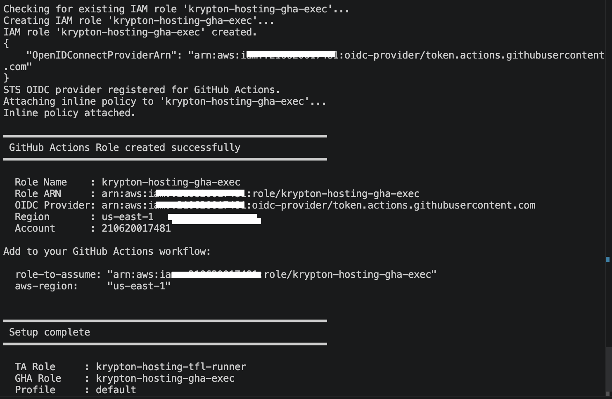
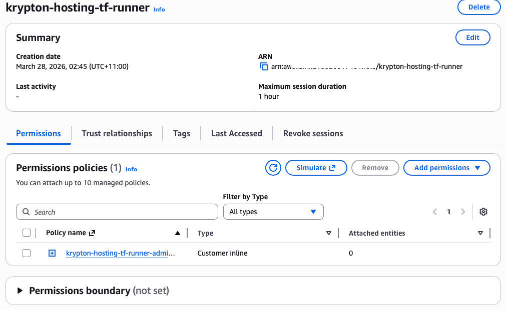
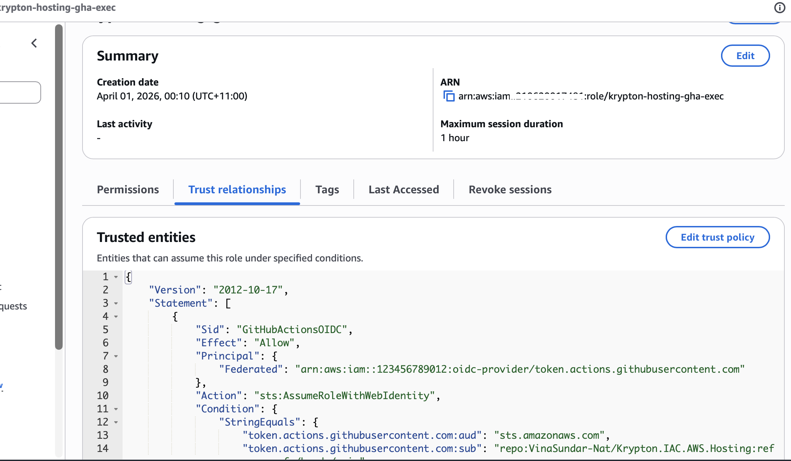

# Krypton.IAC.AWS.Hosting

AWS Infrastructure-as-Code hosting platform using Terraform and IAM Roles Anywhere for keyless On-prem authentication and GHA STS OIDC provider for execution via Github actions pipelines.

---

Self Hosted - pipeline setup 
Note : Cost for AWS Trust anchor - $0.10 per 100 credential requests

## Bootstrap: Certificate, Trust Anchor, Role & Profile Setup

> **Note:** The following steps use a **self-signed certificate** as a temporary trust anchor during initial implementation. This should be replaced with a certificate issued by a registered CA provider before production use.

The bootstrap process is a one-time setup that establishes the IAM trust chain required for the Terraform runner to authenticate to AWS without long-lived static credentials. It comprises three steps:

1. Create a dedicated IAM user with the minimum permissions needed to run the CLI scripts
2. Generate a self-signed CA certificate to act as the trust anchor
3. Create the IAM role, trust anchor, and Roles Anywhere profile in AWS

---

## Step 1 — Create the IAM Bootstrap User

A dedicated IAM user (`admin_krypton`) is required to execute the CLI scripts in Steps 2 and 3. This user holds the minimum permissions needed to create the trust anchor, IAM role, and Roles Anywhere profile. It is a **bootstrap-only** credential — once setup is complete the Terraform runner authenticates via Roles Anywhere and this user's access keys should be deactivated.

### 1.1 — Create the user

In the AWS Console navigate to **IAM → Users → Create user**. Name the user `admin_krypton` (or your preferred name) and do not enable console access.


After creation, go to the **Security credentials** tab and create an **Access key** with the use-case *Other*. Save the Access Key ID and Secret Access Key — they are required in Step 3.

### 1.2 — Attach the permissions policy

Attach the following inline policy (`Krypton_CLI_IAM`) to the user. The policy grants the minimum actions needed to create the trust anchor, IAM role, inline permissions policy, and Roles Anywhere profile.


The user should have two policies attached:
- `Krypton_CLI_IAM` — customer inline policy (below)
- `SignInLocalDevelopmentAccess` — AWS managed policy for local CLI sign-in

**Policy document** (`.docs/policy.json`):

```json
{
  "Version": "2012-10-17",
  "Statement": [
    {
      "Sid": "CreateAndManageRoles",
      "Effect": "Allow",
      "Action": [
        "iam:CreateRole",
        "iam:GetRole",
        "iam:AttachRolePolicy",
        "iam:PutRolePolicy",
        "iam:TagRole"
      ],
      "Resource": "*"
    },
    {
      "Sid": "ManageRolesAnywhere",
      "Effect": "Allow",
      "Action": [
        "rolesanywhere:CreateTrustAnchor",
        "rolesanywhere:CreateProfile",
        "rolesanywhere:GetTrustAnchor",
        "rolesanywhere:ListTrustAnchors",
        "rolesanywhere:TagResource"
      ],
      "Resource": "*"
    },
    {
      "Sid": "AllowPassRole",
      "Effect": "Allow",
      "Action": "iam:PassRole",
      "Resource": "*",
      "Condition": {
        "StringEquals": {
          "iam:PassedToService": "rolesanywhere.amazonaws.com"
        }
      }
    },
    {
      "Sid": "AllowRolesAnywhereServiceLinkedRole",
      "Effect": "Allow",
      "Action": "iam:CreateServiceLinkedRole",
      "Resource": "arn:aws:iam::*:role/aws-service-role/rolesanywhere.amazonaws.com/AWSServiceRoleForRolesAnywhere",
      "Condition": {
        "StringEquals": {
          "iam:AWSServiceName": "rolesanywhere.amazonaws.com"
        }
      }
    },
    {
      "Sid": "AllowOIDCProviderManagement",
      "Effect": "Allow",
      "Action": [
        "iam:CreateOpenIDConnectProvider",
        "iam:GetOpenIDConnectProvider",
        "iam:ListOpenIDConnectProviders"
      ],
      "Resource": "*"
    }
  ]
}
```

---

## Step 2 — Generate the Self-Signed Certificate

Run `create-cert.sh` from the `.auth` directory to generate a self-signed CA certificate and private key. This certificate will be uploaded to IAM Roles Anywhere as the trust anchor source in Step 3.

```bash
cd .auth
./create-cert.sh
```

The script generates an EC key pair (P-256 by default) and a self-signed CA certificate valid for 10 years using the configuration in `vars.sh`. On completion it prints the certificate details and the paths to the output files.


Key outputs written to `.auth/cert/`:

| File | Purpose |
|---|---|
| `krypton_hosting_provider_trust_anchor.key.pem` | Private key — **keep secret, never upload** |
| `krypton_hosting_provider_trust_anchor.cert.pem` | Public CA certificate — uploaded as the trust anchor |

Default values are set in `.auth/vars.sh` and can be overridden by environment variable or flag:

| Variable | Default | Description |
|---|---|---|
| `CERT_CN` | `krypton-hosting-provider-trust-anchor` | Certificate common name |
| `TA_NAME` | `krypton-hosting-platform-digiplac` | Trust anchor name in AWS |
| `TA_ROLE_NAME` | `krypton-hosting-tfl-runner` | IAM role name (Roles Anywhere) |
| `GHA_ROLE_NAME` | `krypton-hosting-gha-exec` | IAM role name (GitHub Actions) |
| `KEY_TYPE` | `ec` | Key algorithm (`ec` or `rsa`) |
| `EC_CURVE` | `prime256v1` | EC curve (P-256 or P-384) |
| `CERT_DAYS` | `3650` | Certificate validity in days |

---

## Step 3 — Create the Roles Anywhere Trust Anchor & GitHub Actions Role

This step is split into two sub-scripts orchestrated by a single entry point.

### Architecture overview

| Auth method | Script | AWS resources created |
|---|---|---|
| IAM Roles Anywhere (local Terraform) | `create-ta-role.sh` | Trust anchor, IAM role `krypton-hosting-tfl-runner`, Roles Anywhere profile |
| GitHub Actions OIDC | `create-gha-role.sh` | IAM role `krypton-hosting-gha-exec`, OIDC provider `token.actions.githubusercontent.com` |

Run the orchestrator from the `.auth` directory. It prompts for AWS credentials **once**, then calls each sub-script in turn:

```bash
cd .auth
./setup.sh
```

`setup.sh` flow:
1. Prompt for `admin_krypton` AWS credentials (written to a named CLI profile)
2. Verify credentials via `sts:GetCallerIdentity`
3. **Step 1 of 2** — run `create-ta-role.sh`
4. **Step 2 of 2** — run `create-gha-role.sh`

You can also run each sub-script independently if you only need to (re-)create one of the roles:

```bash
./create-ta-role.sh  --region us-east-1 --profile krypton
./create-gha-role.sh --region us-east-1 --profile krypton
```

Each script checks whether its resources already exist and prompts to reuse them, making re-runs safe.

### Credential input

When prompted, enter the Access Key ID and Secret Access Key for the `admin_krypton` user created in Step 1. The secret key input is hidden. Leave Session Token blank unless using STS or SSO.


---

### Step 3a — Trust Anchor Role (`create-ta-role.sh`)

`create-ta-role.sh` performs:
1. Locate and validate the CA certificate generated in Step 2 (checks `CA:TRUE`)
2. Check for an existing trust anchor named `krypton-hosting-platform-digiplac` — prompt to reuse if found
3. Upload the certificate bundle to create the IAM Roles Anywhere **trust anchor**
4. Check for an existing IAM role `krypton-hosting-tfl-runner` — prompt to reuse if found
5. Create the IAM **role** using `roles/role-ta.json` as the assume-role policy document
6. Attach the inline **permissions policy** from `roles/admin-role.json`
7. Check for an existing Roles Anywhere profile — prompt to reuse if found
8. Create the Roles Anywhere **profile** (`krypton-hosting-tfl-runner-profile`) linked to the role

On completion the script prints a summary including Terraform variable hints:


The output confirms:
- **Trust Anchor Name / ARN** — Roles Anywhere trust anchor backed by the self-signed certificate
- **Role Name / ARN** — IAM role the Terraform runner will assume (`krypton-hosting-tfl-runner`)
- **Profile Name / ARN** — Roles Anywhere profile (`krypton-hosting-tfl-runner-profile`)
- **Terraform variable hints** — `trust_anchor_arn`, `role_arn`, and `rolesanywhere_profile_arn` ready to paste

---

### Step 3b — GitHub Actions Role (`create-gha-role.sh`)

`create-gha-role.sh` performs:
1. Check for an existing IAM role `krypton-hosting-gha-exec` — prompt to reuse if found
2. Create the IAM **role** using `roles/role-gha-sts.json` as the assume-role policy document
3. Register the GitHub OIDC provider (`token.actions.githubusercontent.com`) — idempotent, skipped if already present
4. Attach the inline **permissions policy** from `roles/admin-role.json`

#### Trust policy (`roles/role-gha-sts.json`)

```json
{
  "Version": "2012-10-17",
  "Statement": [
    {
      "Sid": "GitHubActionsOIDC",
      "Effect": "Allow",
      "Principal": {
        "Federated": "arn:aws:iam::<ACCOUNT_ID>:oidc-provider/token.actions.githubusercontent.com"
      },
      "Action": "sts:AssumeRoleWithWebIdentity",
      "Condition": {
        "StringEquals": {
          "token.actions.githubusercontent.com:aud": "sts.amazonaws.com",
          "token.actions.githubusercontent.com:sub": [
            "repo:VinaSundar-Nat/Krypton.IAC.AWS.Hosting:ref:refs/heads/main"
          ]
        }
      }
    }
  ]
}
```

> **Note:** `StringEquals` on `:sub` pins the role to the exact repository and branch. Update the value in `roles/role-gha-sts.json` if the source repo or branch changes.

#### GitHub Actions workflow usage

Add the following permissions and `configure-aws-credentials` step to any workflow job that needs AWS access:

```yaml
permissions:
  id-token: write   # Required for OIDC token request
  contents: read

steps:
  - name: Configure AWS credentials
    uses: aws-actions/configure-aws-credentials@v4
    with:
      role-to-assume: arn:aws:iam::<ACCOUNT_ID>:role/krypton-hosting-gha-exec
      aws-region: us-east-1
```

The `role-to-assume` ARN and `aws-region` values are printed at the end of `create-gha-role.sh`.

On completion the script prints a summary:



---

## Verify in the AWS Console

### IAM Role — Roles Anywhere (`krypton-hosting-tfl-runner`)

Navigate to **IAM → Roles → krypton-hosting-tfl-runner**. Confirm the role exists with the `krypton-hosting-tfl-runner-admin-policy` inline policy attached.



### IAM Role — GitHub Actions (`krypton-hosting-gha-exec`)

Navigate to **IAM → Roles → krypton-hosting-gha-exec**. Confirm the role exists with the `krypton-hosting-gha-exec-admin-policy` inline policy attached and the trust relationship shows `token.actions.githubusercontent.com` as the federated principal.



### Trust Anchor & Profile

Navigate to **IAM → Roles Anywhere** (or search *Roles Anywhere* in the console). Confirm the trust anchor `krypton-hosting-platform-digiplac` and the profile `krypton-hosting-tf-runner-profile` are both present with **Enabled** status.


### Certificate Upload

Click into the trust anchor `krypton-hosting-platform-digiplac` and expand **Source data**. The certificate bundle field should contain the PEM-encoded self-signed certificate beginning with `-----BEGIN CERTIFICATE-----`.


---

## Next Steps

- Replace the self-signed certificate with one issued by your CA provider before production use
- Deactivate or delete the `admin_krypton` bootstrap access keys after setup
- Add the Roles Anywhere ARNs to the appropriate `terraform.tfvars` files (`trust_anchor_arn`, `role_arn`, `rolesanywhere_profile_arn`)
- Update `roles/role-gha-sts.json` with the real account ID and add it to your GitHub Actions workflow (`role-to-assume`)
- Scope down `roles/admin-role.json` to only the Terraform actions required by your deployment
