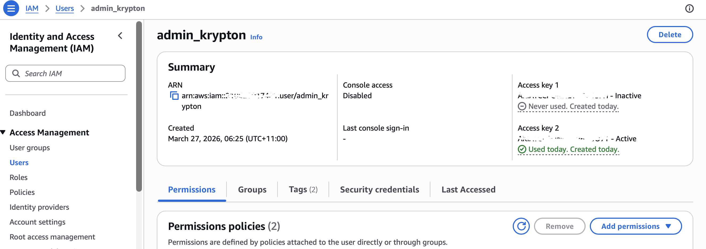
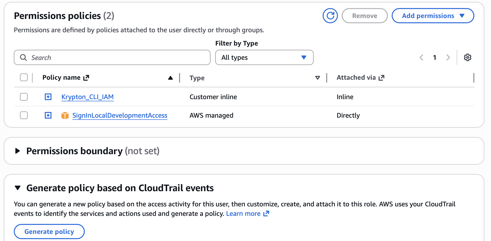
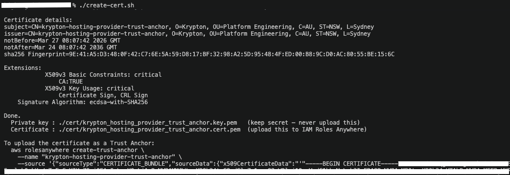
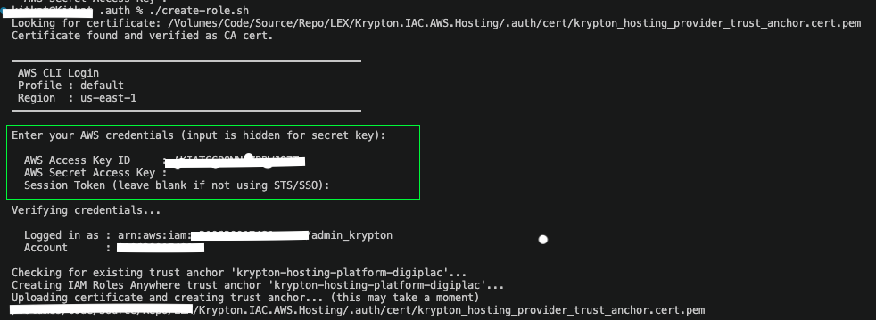
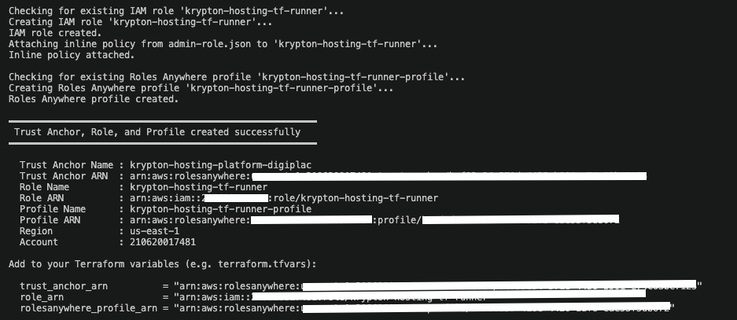
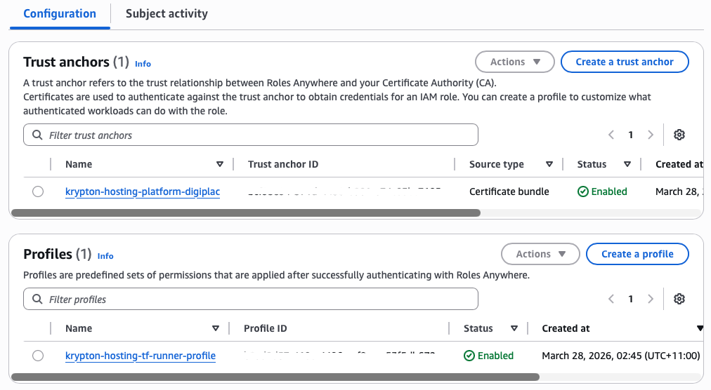
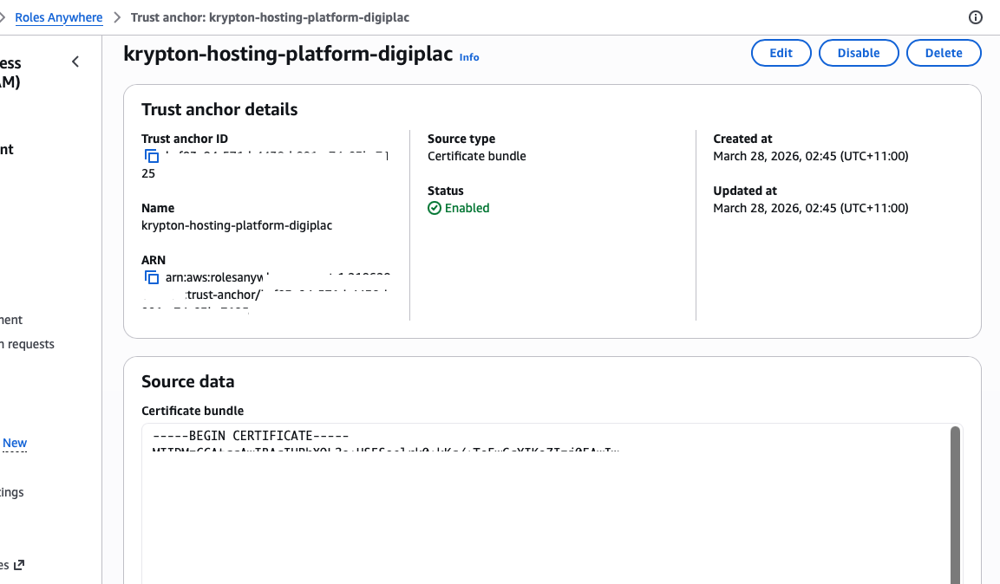

# Krypton.IAC.AWS.Hosting

AWS Infrastructure-as-Code hosting platform using Terraform and IAM Roles Anywhere for keyless authentication.

---

## Bootstrap: Certificate, Trust Anchor, Role & Profile Setup

> **Note:** The following steps use a **self-signed certificate** as a temporary trust anchor during initial implementation. This should be replaced with a certificate issued by a registered CA provider before production use.

The bootstrap process is a one-time setup that establishes the IAM trust chain required for the Terraform runner to authenticate to AWS without long-lived static credentials. It comprises three steps:

1. Create a dedicated IAM user with the minimum permissions needed to run the CLI scripts
2. Generate a self-signed CA certificate to act as the trust anchor
3. Create the IAM role, trust anchor, and Roles Anywhere profile in AWS

---

## Step 1 — Create the IAM Bootstrap User

A dedicated IAM user (`admin_krypton`) is required to execute the CLI scripts in Steps 2 and 3. This user holds the minimum permissions needed to create the trust anchor, IAM role, and Roles Anywhere profile. It is a **bootstrap-only** credential — once setup is complete the Terraform runner authenticates via Roles Anywhere and this user's access keys should be deactivated.

### 1.1 — Create the user

In the AWS Console navigate to **IAM → Users → Create user**. Name the user `admin_krypton` (or your preferred name) and do not enable console access.



After creation, go to the **Security credentials** tab and create an **Access key** with the use-case *Other*. Save the Access Key ID and Secret Access Key — they are required in Step 3.

### 1.2 — Attach the permissions policy

Attach the following inline policy (`Krypton_CLI_IAM`) to the user. The policy grants the minimum actions needed to create the trust anchor, IAM role, inline permissions policy, and Roles Anywhere profile.



The user should have two policies attached:
- `Krypton_CLI_IAM` — customer inline policy (below)
- `SignInLocalDevelopmentAccess` — AWS managed policy for local CLI sign-in

**Policy document** (`.docs/policy.json`):

```json
{
    "Version": "2012-10-17",
    "Statement": [
        {
            "Sid": "CreateAndManageRoles",
            "Effect": "Allow",
            "Action": [
                "iam:CreateRole",
                "iam:GetRole",
                "iam:AttachRolePolicy",
                "iam:PutRolePolicy",
                "iam:TagRole"
            ],
            "Resource": "*"
        },
        {
            "Sid": "ManageRolesAnywhere",
            "Effect": "Allow",
            "Action": [
                "rolesanywhere:CreateTrustAnchor",
                "rolesanywhere:CreateProfile",
                "rolesanywhere:GetTrustAnchor",
                "rolesanywhere:ListTrustAnchors",
                "rolesanywhere:TagResource"
            ],
            "Resource": "*"
        },
        {
            "Sid": "AllowPassRole",
            "Effect": "Allow",
            "Action": "iam:PassRole",
            "Resource": "*",
            "Condition": {
                "StringEquals": {
                    "iam:PassedToService": "rolesanywhere.amazonaws.com"
                }
            }
        },
        {
            "Sid": "AllowRolesAnywhereServiceLinkedRole",
            "Effect": "Allow",
            "Action": "iam:CreateServiceLinkedRole",
            "Resource": "arn:aws:iam::*:role/aws-service-role/rolesanywhere.amazonaws.com/AWSServiceRoleForRolesAnywhere",
            "Condition": {
                "StringEquals": {
                    "iam:AWSServiceName": "rolesanywhere.amazonaws.com"
                }
            }
        }
    ]
}
```

---

## Step 2 — Generate the Self-Signed Certificate

Run `create-cert.sh` from the `.auth` directory to generate a self-signed CA certificate and private key. This certificate will be uploaded to IAM Roles Anywhere as the trust anchor source in Step 3.

```bash
cd .auth
./create-cert.sh
```

The script generates an EC key pair (P-256 by default) and a self-signed CA certificate valid for 10 years using the configuration in `vars.sh`. On completion it prints the certificate details and the paths to the output files.



Key outputs written to `.auth/cert/`:

| File | Purpose |
|---|---|
| `krypton_hosting_provider_trust_anchor.key.pem` | Private key — **keep secret, never upload** |
| `krypton_hosting_provider_trust_anchor.cert.pem` | Public CA certificate — uploaded as the trust anchor |

Default values are set in `.auth/vars.sh` and can be overridden by environment variable or flag:

| Variable | Default | Description |
|---|---|---|
| `CERT_CN` | `krypton-hosting-provider-trust-anchor` | Certificate common name |
| `TA_NAME` | `krypton-hosting-platform-digiplac` | Trust anchor name in AWS |
| `ROLE_NAME` | `krypton-hosting-tf-runner` | IAM role name |
| `KEY_TYPE` | `ec` | Key algorithm (`ec` or `rsa`) |
| `EC_CURVE` | `prime256v1` | EC curve (P-256 or P-384) |
| `CERT_DAYS` | `3650` | Certificate validity in days |

---

## Step 3 — Create the Trust Anchor, Role & Profile

Run `create-role.sh` from the `.auth` directory. This single script performs all remaining AWS provisioning in sequence:

```bash
cd .auth
./create-role.sh
```

The script will:
1. Locate and validate the CA certificate generated in Step 2
2. Prompt for the bootstrap IAM user credentials
3. Verify the credentials against `sts:GetCallerIdentity`
4. Create the IAM Roles Anywhere **trust anchor** (`krypton-hosting-platform-digiplac`) backed by the certificate bundle
5. Create the IAM **role** (`krypton-hosting-tf-runner`) using `role.json` as the assume-role policy document
6. Attach the inline **permissions policy** from `admin-role.json` to the role
7. Create the Roles Anywhere **profile** (`krypton-hosting-tf-runner-profile`) linked to the role

Each resource is checked for prior existence — if found, the script prompts to reuse it rather than erroring out, making re-runs safe.

### Credential input

When prompted, enter the Access Key ID and Secret Access Key for the `admin_krypton` user created in Step 1. The secret key input is hidden. Leave Session Token blank unless using STS or SSO.



### Success output

On completion the script prints a summary of all created resources and the ARN values to copy into `terraform.tfvars`.



The output confirms:
- **Trust Anchor Name / ARN** — the Roles Anywhere trust anchor backed by the self-signed certificate
- **Role Name / ARN** — the IAM role the Terraform runner will assume (`krypton-hosting-tf-runner`)
- **Profile Name / ARN** — the Roles Anywhere profile (`krypton-hosting-tf-runner-profile`) that scopes the role
- **Terraform variable hints** — `trust_anchor_arn`, `role_arn`, and `rolesanywhere_profile_arn` ready to paste

---

## Verify in the AWS Console

### IAM Role

Navigate to **IAM → Roles → krypton-hosting-tf-runner**. Confirm the role exists with the `krypton-hosting-tf-runner-admin-policy` inline policy attached.


### Trust Anchor & Profile

Navigate to **IAM → Roles Anywhere** (or search *Roles Anywhere* in the console). Confirm the trust anchor `krypton-hosting-platform-digiplac` and the profile `krypton-hosting-tf-runner-profile` are both present with **Enabled** status.



### Certificate Upload

Click into the trust anchor `krypton-hosting-platform-digiplac` and expand **Source data**. The certificate bundle field should contain the PEM-encoded self-signed certificate beginning with `-----BEGIN CERTIFICATE-----`.



---

## Next Steps

- Replace the self-signed certificate with one issued by your CA provider before production use
- Deactivate or delete the `admin_krypton` bootstrap access keys after setup
- Add the output ARNs to the appropriate `config/<env>/terraform.tfvars` files
